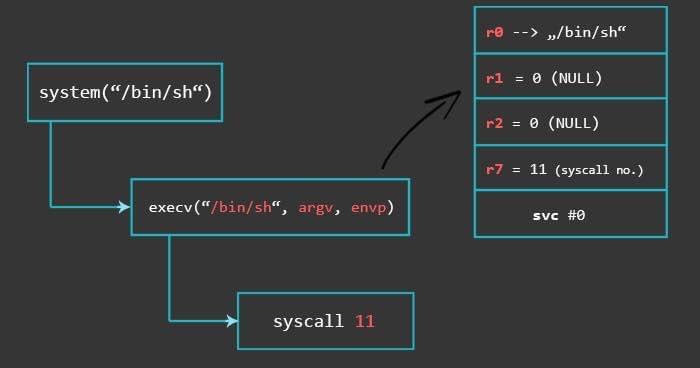

# ARM Exploit

- `Overview:`
  * https://www.youtube.com/watch?v=gfmRrPjnEw4
  * `Compile, run and debug`:
    + https://azeria-labs.com/arm-on-x86-qemu-user/
    + https://github.com/chung96vn/env-setup/tree/master/arm
  * `Challenges`:
    + https://azeria-labs.com/writing-arm-assembly-part-1/
    + https://book-of-gehn.github.io/articles/2021/01/14/Smashing-ARM-Stack-for-Fun-Part-I.html
    + https://twitter.com/0xor0ne/status/1694243230416539837?s=46
    + https://blog.perfect.blue/ROPing-on-Aarch64
  
```bash
#!/bin/bash
file arm
set sysroot /usr/aarch64-linux-gnu
# gef
# target remote localhost:9000

# pwndbg
target extended-remote :9000

# set architecture arm

$ qemu-arm -g 1234 ./my/arm/binary
$ gdb-multiarch ./my/arm/binary
gef➤  set architecture arm
gef➤  gef-remote localhost:1234

# fix error context
# gef-remote --qemu-user --qemu-binary ./note_keeper_arm localhost 1234

```


