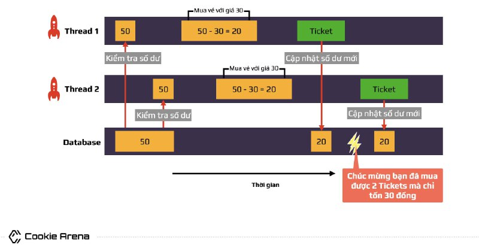

# Race Condition

- Khi một chương trình `(parent process)` tạo ra các chương trình con `(more child processes)` mà các chương trình con đó truy xuất chung tới 1 biến của `parent process` (hoặc biến toàn cục) nào đó - ở đây có thể là cộng trừ giá trị hoặc là nối chuỗi,... => thì sẽ gây ra `race_condition`.
- Một số hàm tạo `child processes` từ `parent process` trong code C như: `fork()`, `pthread_create()` - lib lpthread, ...
- VD CTF: [wp racecar](https://www.youtube.com/watch?v=GxAKQuRmzMY) .

