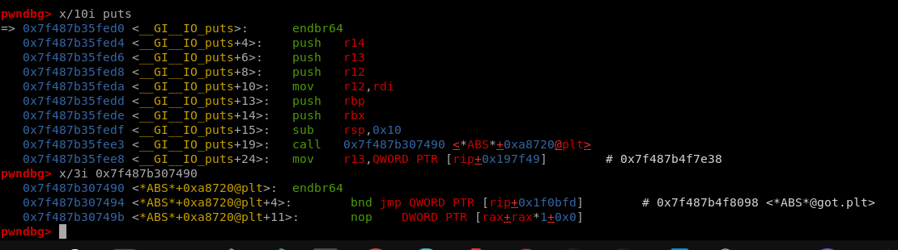
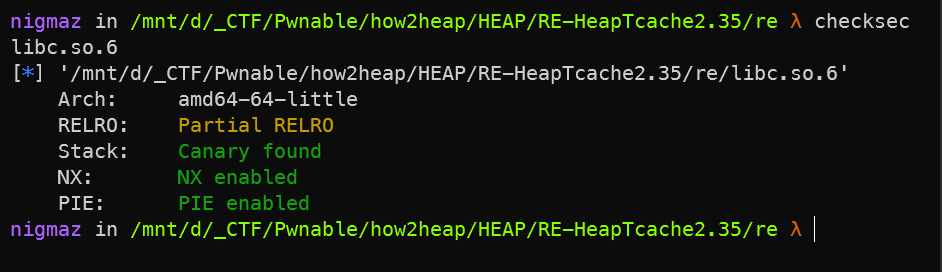

# HEAPv2.0

- Address heap decrypt from fd t-cache. 
- Control heap chunk management t-cache => control list and count t-cache.

## [0]. Technique Exploit Heap 2.0 (glibc >= 2.32):

- G-libc >= 2.32 set safe-linkking: https://research.checkpoint.com/2020/safe-linking-eliminating-a-20-year-old-malloc-exploit-primitive/
- G-libc >= 2.35 delete __free_hook, __malloc_hook.
- Khi khai thác libc >= 2.35 có 3 hướng có thể khai thác (cần leak được heap address và libc base):
   * `tls_dtor_list` https://m101.github.io/binholic/2017/05/20/notes-on-abusing-exit-handlers.html
        + The micro PTR_DEMANGLE will rotate bit right 17 bit and xor with the guard which is random value.
   * FSOP on stdout to leak environ and then ROP over the stack.
   * Overwrite ABS_GOT_LIBC (puts, realloc, ...)

   

   
