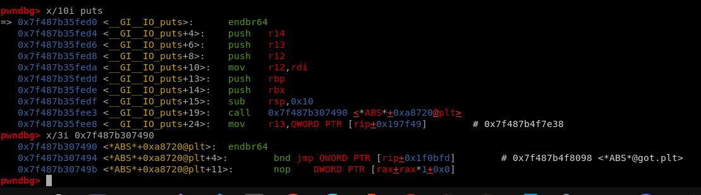
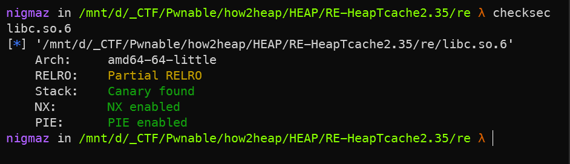

# Heap Exploit

- [Source Code GLIBC](https://elixir.bootlin.com/glibc/latest/source) .
- Heap Docx tổng hợp tham khảo
    * `All view heap teachnique exploit` https://0x434b.dev/overview-of-glibc-heap-exploitation-techniques/
  
    * `Heap security check` https://heap-exploitation.dhavalkapil.com/diving_into_glibc_heap/security_checks
- [how2heap](https://github.com/shellphish/how2heap) . 
    * `WP` https://hackmd.io/@u1f383/Sy_2pqMAP

## [0]. Overview:
- Thay vào đó, heap manager-heap định kỳ "HỢP NHẤT" heap. Giai đoạn hợp nhất xảy ra bất cứ khi nào 1 yêu cầu malloc được thực hiện lớn hơn dịch vụ có thể ucar fastbins (thường là > 64kB).
- Now, leaking libc, we just follow the steps above. To make sure these chunks don't end up in smaller bins, we have to make them large, so 1350 bytes was chosen arbitrarily. We'll have to interact with the smaller bins soon, but just for now, for this leak to work in this way, large-ish chunks are sufficient.
- `gdb command in heap:` 
```
x/40gx &main_arena 
x/40gx (long long)(&__malloc_hook)-0x80
set max-visualize-chunk-size 0x500
```
- Một số subtechnique như:
   * Chunk overlapping
   * Off-by-one
   * ...
- `FASTBINS`
   * `Có thể leak bằng fastbins nếu sử dụng ghi đè p8(lastbyte) .`
   * Cùng là fastbins nhưng [Lưu ý khi dùng fasstbins attack cần set được size của vị trí muốn ghi thỏa mãn là 1 khối chunk fastbin]
- `UNSORTEDBINS`
   * Fake unsorted bins <= 2.29 bypass check là tạo fake chunk đằng sau tại vị trí đúng bằng chuk unsorted + size để có bit M = 1.
   * Unsortedbin Attack - malloc 1 chunk rồi free chunk đó để nó thuộc unsortedbin, khi chunk đó được cấp phát lại - Bây giờ khi một chunk được lấy ra khỏi unsortedbin , một con trỏ để ghi vào đoạn sau của nó - `[nó ghi con trỏ fd của nó vào bk+0x10 tức là bỏ nó ra khỏi mắt xích rồi nối lại hai mắt xích trước và sau nó với nhau bằng bk và fd]`; Cụ thể một con trỏ sẽ được ghi vào `bk + 0x10` trên x64 (`bk + 0x8` cho x86). `Nếu có 1 unsortedbins thì bk và fd của khối đó chỉ về main_arena+88`.
   * Sau khi unsortedbins attack thì khối unsortedbins bị set thành corrupted => Tham chiếu lại vùng nhớ đó không cẩn thận => dễ xảy ra lỗi .
   ```
   chunk - 0x20 size thì next chunk lưu ở main_arena+16
   chunk - 0x60 size thì next chunk lưu ở main_arena+48 (bài này thì trường hợp này lại exploit thành công).
   ```
   * Để ý các function của chương trình vd chương trình có hàm edit password nghĩa là có thể khi có bug ta sẽ cố gắng khai thác làm sao để free được 1 đoạn nằm trên vị trí password thì sẽ có thể dùng function changePassword để thay đổi dữ liệu => Use After Free or Double Free, ... 
   * [trigger double free -> call __malloc_hook](https://blog.osiris.cyber.nyu.edu/2017/09/30/csaw-ctf-2017-auir/) - VD[Secret garden - pwnable.tw]
- `BINS list Fastbins, T-cache.`


## [1]. Technique Exploit Heap 2.0 (glibc >= 2.32):

- G-libc >= 2.32 set safe-linkking: https://research.checkpoint.com/2020/safe-linking-eliminating-a-20-year-old-malloc-exploit-primitive/
- G-libc >= 2.35 delete __free_hook, __malloc_hook.
- Khi khai thác libc >= 2.35 có 3 hướng có thể khai thác (cần leak được heap address và libc base):
   * `tls_dtor_list` https://m101.github.io/binholic/2017/05/20/notes-on-abusing-exit-handlers.html
   * FSOP on stdout to leak environ and then ROP over the stack.
   * Overwrite ABS_GOT_LIBC (puts, realloc, ...)

   

   


