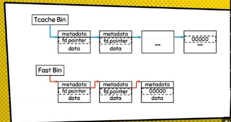

# Heap Exploit

- Overview:

    * `gdb command in heap:` 
    ```
        x/40gx &main_arena 
        x/40gx (long long)(&__malloc_hook)-0x80
        set max-visualize-chunk-size 0x500
    ```
    * fake unsorted bins <= 2.29 bypass check là tạo fake chunk đằng sau tại vị trí đúng bằng chuk unsorted + size để có bit M = 1.

    * Unsortedbin Attack - malloc 1 chunk rồi free chunk đó để nó thuộc unsortedbin, khi chunk đó được cấp phát lại - Bây giờ khi một chunk được lấy ra khỏi unsortedbin , một con trỏ để ghi vào đoạn sau của nó [nó ghi con trỏ fd của nó vào bk+0x10 tức là bỏ nó ra khỏi mắt xích rồi nối lại hai mắt xích trước và sau nó với nhau bằng bk và fd]; Cụ thể một con trỏ sẽ được ghi vào `bk + 0x10` trên x64 (`bk + 0x8` cho x86). `Nếu có 1 unsortedbins thì bk và fd của khối đó chỉ về main_arena+88` .

    > Sau khi unsortedbins attack thì khối unsortedbins bị set thành corrupted => dễ xảy ra lỗi 

    * Fastbin Attack: VD[babyheap - 0ctf 2017] 

    (https://medium.com/@thanhtuan9906/0ctf-quals-2017-babyheap-e2638b3e727b)

    * `Có thể leak bằng fastbins nếu sử dụng ghi đè p8(lastbyte) .`

    * Cùng là fastbins nhưng [Lưu ý khi dùng fasstbins attack cần set được size của vị trí muốn ghi thỏa mãn là 1 khối chunk fastbin]
    ```
    chunk - 0x20 size thì next chunk lưu ở main_arena+16
                    
    chunk - 0x60 size thì next chunk lưu ở main_arena+48 (bài này thì trường hợp này lại exploit thành công).
    ```

    * Để ý các function của chương trình vd chương trình có hàm edit password nghĩa là có thể khi có bug ta sẽ cố gắng khai thác làm sao để free được 1 đoạn nằm trên vị trí password thì sẽ có thể dùng function changePassword để thay đổi dư liệu => Use After Free or Double Free, ... 

    * [trigger double free -> call __malloc_hook](https://blog.osiris.cyber.nyu.edu/2017/09/30/csaw-ctf-2017-auir/) - VD[Secret garden - pwnable.tw]
    * Bins list fastbins, t-cache.

      

- Technique:


