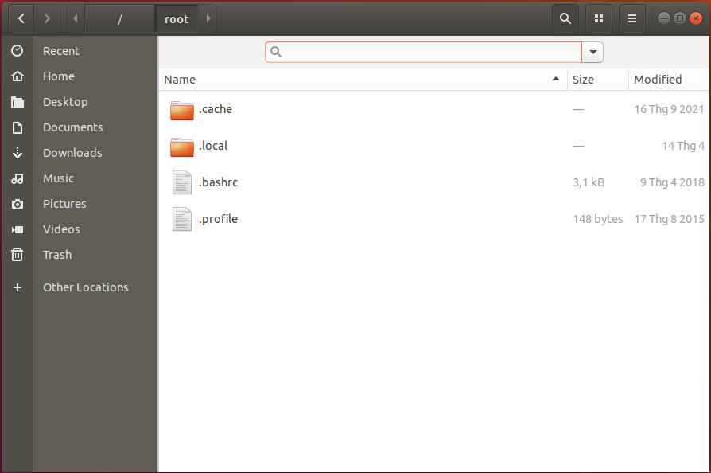
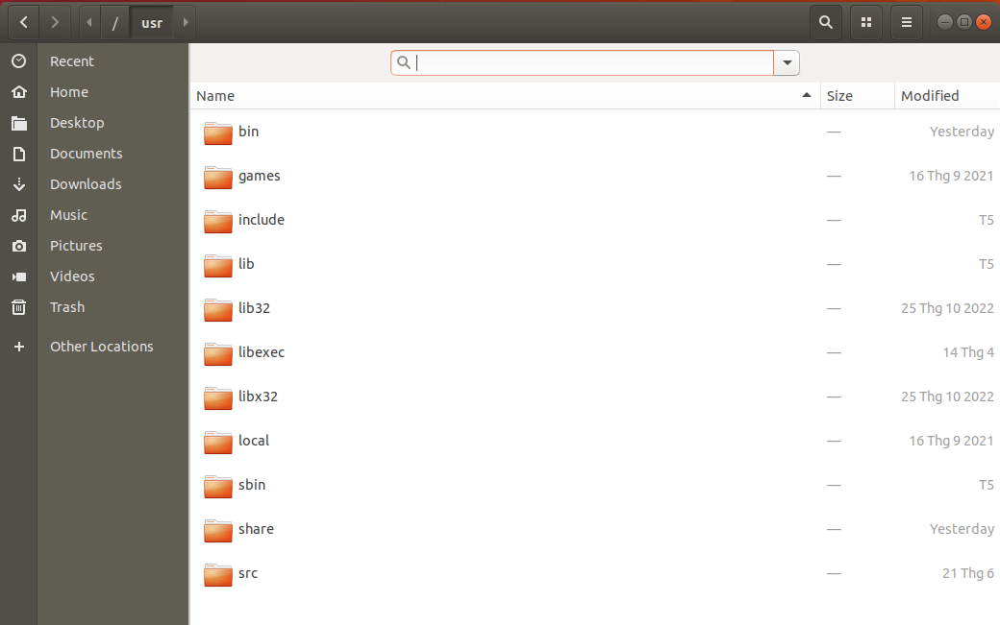

# Linux File System

- The Linux File System defines the directory structure and directory contents in Unix-like operating systems. It is maintained by the Linux Foundation.
    * all files and directories appear under the root directory /, even if they are stored on different physical or virtual devices.
    * 

## [0]. `/root`
- Every single file and directory starts from the root directory.
- Only root user has write privilege under this directory.
- Please note that /root is root user’s home directory, which is not same as /.

## [1]. `/bin`

- Contains binary executables.
- Common linux commands you need to use in single-user modes are located under this directory.
- Commands used by all the users of the system are located here.
- For example: ps, ls, ping, grep, cp.

## [2]. `/sbin`

- Just like /bin, /sbin also contains binary executables.
- But, the linux commands located under this directory are used typically by system aministrator, for system maintenance purpose.
- For example: iptables, reboot, fdisk, ifconfig, swapon

## [3]. `/etc`

- Contains configuration files required by all programs.
- This also contains startup and shutdown shell scripts used to start/stop individual programs.
- For example: /etc/resolv.conf, /etc/logrotate.conf

## [4]. `/dev`

- Contains device files.
- These include terminal devices, usb, or any device attached to the system.
- For example: /dev/tty1, /dev/usbmon0

## [5]. `/proc`

- Contains information about system process.
- This is a pseudo filesystem contains information about running process. For example: /proc/{pid} directory contains information about the process with that particular pid.
- This is a virtual filesystem with text information about system resources. For example: /proc/uptime

## [6]. `/var`

- Content of the files that are expected to grow can be found under this directory.
- This includes — system log files (/var/log); packages and database files (/var/lib); emails (/var/mail); print queues (/var/spool); lock files (/var/lock); temp files needed across reboots (/var/tmp);

## [7]. `/tmp`

- Directory that contains temporary files created by system and users.
- Files under this directory are deleted when system is rebooted.

## [8]. `/usr`

- Contains binaries, libraries, documentation, and source-code for second level programs.
- /usr/bin contains binary files for user programs. If you can’t find a user binary under /bin, look under /usr/bin. For example: at, awk, cc, less, scp
- ` /usr/sbin` contains binary files for system administrators. If you can’t find a system binary under /sbin, look under /usr/sbin. For example: atd, cron, sshd, useradd, userdel
- /usr/lib contains libraries for /usr/bin and /usr/sbin
- /usr/local contains users programs that you install from source. For example, when you install apache from source, it goes under /usr/local/apache2
- /usr/src holds the Linux kernel sources, header-files and documentation.

## [9]. `/home`

- Home directories for all users to store their personal files
- For examples: /home/john, /home/dylan.

## [10]. `/boot`

- Contains boot loader related files
- Kernel initrd, vmlinux, grub files are located under /boot
- Kernel initrd, vmlinux, grub files are located under /boot

## [11]. `/lib`

- Contains library files that supports the binaries located under /bin and /sbin
- Library filenames are either ld* or lib*.so.*
- For example: ld-2.11.1.so, libncurses.so.5.7

## [12]. `/opt`

- Contains add-on applications from individual vendors.
- add-on applications should be installed under either /opt/ or /opt/ sub-directory.

## [13]. `/mnt`

- Temporary mount directory where sysadmins can mount filesystems.

## [14]. `/media`

- Temporary mount directory for removable devices.
- For examples, /media/cdrom for CD-ROM; /media/floppy for floppy drives; /media/cdrecorder for CD writer

## [15]. `/srv`

- Contains server specific services related data.
- For example, /srv/cvs contains CVS related data

## REFERENCES:

- https://twitter.com/maybeshalinii/status/1694717647332782243?s=46

- https://quocdat.me/posts/linux-file-system-hierarchy/
