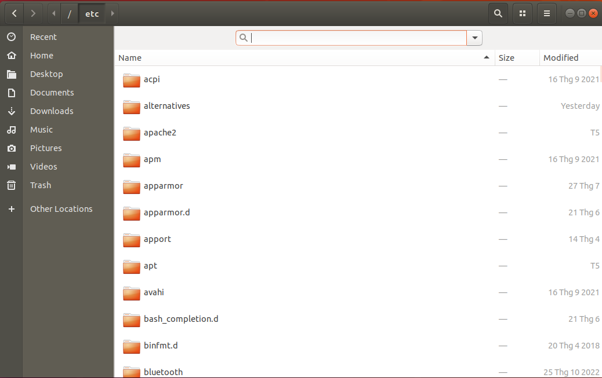
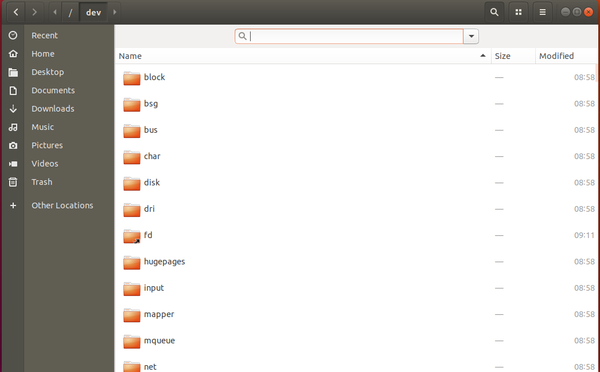

# Linux File System

- The Linux File System defines the directory structure and directory contents in Unix-like operating systems. It is maintained by the Linux Foundation.
    * All files and directories appear under the root directory /, even if they are stored on different physical or virtual devices.
    * Most of these directories exist in all UNIX operating systems and are generally used in much the same way, however the descriptions here are those used specifically for the FHS and are not considered authoritative for platforms other than Linux.
    
    
    
- Here is the Complete Linux File System [Explained]:
```
📁 /
∟ 📄boot
∟ 📁bin
    ∟ 📄ls
    ∟ 📄mkdir
∟ 📁dev
    ∟ 📄sda
∟ 📁etc
    ∟ 📄hostname
    ∟ 📄passwd
    ∟ 📄nginx.conf
∟ 📁home
    ∟ 📁user1
        ∟ 📄.bashrc
    ∟ 📁user2
        ∟ 📄notes.txt
        ∟ 📄.bashrc
∟ 📁lib
    ∟ 📄libcrypto.so
    ∟ 📄libssl.so
∟ 📁mnt
∟ 📁opt
    ∟ 📁app1
        ∟ 📄app1_executable
    ∟ 📁app2
        ∟ 📄app2_executable
∟ 📁proc
∟ 📁root
∟ 📁sbin
    ∟ 📄init
    ∟ 📄shutdown
∟ 📁srv
∟ 📁sys
∟ 📁tmp
∟ 📁usr
    ∟ 📁bin
        ∟ 📄gcc
        ∟ 📄python
    ∟ 📁include
    ∟ 📁lib
        ∟ 📄libncurses.so
    ∟ 📁local
        ∟ 📁bin
            ∟ 📄custom_app
        ∟ 📁lib
            ∟ 📄libcustom_lib.so
    ∟ 📁share
∟ 📁var
    ∟ 📁log
        ∟ 📄syslog
        ∟ 📄nginx.log
    ∟ 📁www
        ∟ 📁html
            ∟ 📄index.html
```

------------- Explained  --------------

Certainly, let's go through the components of this Linux file system:

1. `/boot`: This directory contains essential files for booting the system.

2. `/bin`: Basic system binaries reside here, such as common command-line utilities like `ls`, `mkdir`, and `cp`.

3. `/dev`: This directory contains device files that represent various devices connected to the system, such as hard drives (`sda`, `sdb`) and pseudo devices like `null`.

4. `/etc`: Configuration files for the system and installed applications are stored here. Examples include `fstab` (filesystem table), `hostname` (system's hostname), `passwd` (user account information), `sudoers` (sudo configuration), and `nginx .conf` (configuration for the Nginx web server).

5. `/home`: User home directories are typically found here. Examples include `user1`, `user2`, and `user3`, each with their files and settings.

6. `/lib`: Shared libraries (similar to Windows DLLs) that programs can use are stored here. Examples are `libcrypto .so` and `libssl .so`.

7. `/mnt`: This directory is often used as a mount point for temporary filesystems.

8. `/opt`: Additional software packages and applications that are not part of the core system can be installed here. Each package may have its own subdirectory, like `app1` and `app2`.

9. `/proc`: A virtual filesystem that provides information about running processes and system status.

10. `/root`: The home directory for the root user.

11. `/sbin`: System binaries essential for system administration, like `init` (the first process) and `shutdown` (to shut down the system).

12. `/srv`: This directory is typically used for data served by the system.

13. `/sys`: Another virtual filesystem that provides information about kernel and devices.

14. `/tmp`: Temporary files are stored here. They are usually cleared on system startup.

15. `/usr`: This directory contains user programs and data.

    - `/usr/bin`: User-level command binaries.
    
    - `/usr/include`: Header files for C/C++ libraries.
    
    - `/usr/lib`: Libraries for programming and software.
    
    - `/usr/local`: Software manually installed by the system administrator.
    
16. `/var`: Variable data that changes frequently.

> Finally, this file system structure reflects a standard layout found in many Linux distributions, with key directories serving specific purposes, from system binaries to user files, libraries, configuration, and temporary data. Keep in mind that while this is a general representation, individual distributions might have variations or additional directories based on their design and purpose.
## [0]. `/root`
- Every single file and directory starts from the root directory and only root user has write privilege under this directory.
- Please note that `/root` is root user’s home directory, which is not same as `/`.


## [1]. `/bin`

- Contains binary executables, common linux commands you need to use in single-user modes are located under this directory.
- Commands used by all the users of the system are located here, example: `ps, ls, ping, grep, cp`.


## [2]. `/sbin`

- Just like /bin, /sbin also contains binary executables.
- But, the linux commands located under this directory are used typically by system aministrator, for system maintenance purpose, example: `iptables, reboot, fdisk, ifconfig, swapon,...`


## [3]. `/etc`

- Contains configuration files required by all programs.
- This also contains startup and shutdown shell scripts used to start/stop individual programs, example: `/etc/resolv.conf, /etc/logrotate.conf`.


## [4]. `/dev`

- Contains device files.
- These include terminal devices, usb, or any device attached to the system, example: `/dev/tty1, /dev/usbmon0`.


## [5]. `/proc`

- Contains information about system process.
- This is a pseudo filesystem contains information about running process, example: `/proc/{pid} directory contains information about the process with that particular pid`.
- This is a virtual filesystem with text information about system resources, example: `/proc/uptime`.


## [6]. `/var`

- Content of the files that are expected to grow can be found under this directory.
- This includes — system log files (/var/log); packages and database files (/var/lib); emails (/var/mail); print queues (/var/spool); lock files (/var/lock); temp files needed across reboots (/var/tmp);


## [7]. `/tmp`

- Directory that contains temporary files created by system and users.
- Files under this directory are deleted when system is rebooted.


## [8]. `/usr`

- Contains binaries, libraries, documentation, and source-code for second level programs.
- /usr/bin contains binary files for user programs. If you can’t find a user binary under /bin, look under /usr/bin. For example: at, awk, cc, less, scp
- ` /usr/sbin` contains binary files for system administrators. If you can’t find a system binary under /sbin, look under /usr/sbin. For example: atd, cron, sshd, useradd, userdel
- /usr/lib contains libraries for /usr/bin and /usr/sbin
- /usr/local contains users programs that you install from source. For example, when you install apache from source, it goes under /usr/local/apache2
- /usr/src holds the Linux kernel sources, header-files and documentation.


## [9]. `/home`

- Home directories for all users to store their personal files
- For examples: /home/john, /home/dylan.


## [10]. `/boot`

- Contains boot loader related files
- Kernel initrd, vmlinux, grub files are located under /boot
- Kernel initrd, vmlinux, grub files are located under /boot


## [11]. `/lib`

- Contains library files that supports the binaries located under /bin and /sbin
- Library filenames are either ld* or lib*.so.*
- For example: ld-2.11.1.so, libncurses.so.5.7


## [12]. `/opt`

- Contains add-on applications from individual vendors.
- add-on applications should be installed under either /opt/ or /opt/ sub-directory.


## [13]. `/mnt`

- Temporary mount directory where sysadmins can mount filesystems.


## [14]. `/media`

- Temporary mount directory for removable devices.
- For examples, /media/cdrom for CD-ROM; /media/floppy for floppy drives; /media/cdrecorder for CD writer


## [15]. `/srv`

- Contains server specific services related data.
- For example, /srv/cvs contains CVS related data


## REFERENCES:

- https://twitter.com/maybeshalinii/status/1694717647332782243?s=46

