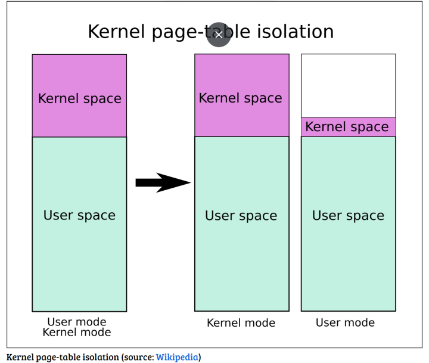

# Kernel Exploit 
>Script exploit.c
- Blogs Series: https://blog.wohin.me/posts/linux-kernel-pwn-01/
- build minimal kernel: https://www.youtube.com/watch?v=asnXWOUKhTA
- Challenges mẫu:
	* [FG-KASLR lkmidas](https://lkmidas.github.io/posts/20210205-linux-kernel-pwn-part-3/#about-kaslr-and-fg-kaslr) .
	* [KASLR - chall Easy Kernel - k3rn3l4rmy](https://ctftime.org/writeup/31392) . 

- Video kiến thức kernel:
	* https://www.youtube.com/watch?v=aFOZIPStugM&list=PLnwLMORCasF5XZPboSq0A5Fwi-6akw7SQ
 	* [pwn-college](https://www.youtube.com/watch?v=j0I2AakUAxk&list=PL-ymxv0nOtqowTpJEW4XTiGQYx6iwa6og) .
        * https://www.youtube.com/watch?v=xHHmoEsJc58

- Remote challenge exploit:
  	* you can just zip your exp (binary) via gzip and then base64 encode it.
	* then copy the base64 to remote shell and unzip it.
	* link discord zer0pts-2023: https://discord.com/channels/814766309866471424/1129970787248517192 .
- Challenge:
  	* XCTF
  	* HakcTheBox
```c
#define _GNU_SOURCE
#include <stdio.h>
#include <sys/types.h>
#include <sys/stat.h>
#include <fcntl.h>
#include <sched.h>
#include <sys/mman.h>
#include <signal.h>
#include <sys/syscall.h>
#include <sys/ioctl.h>
#include <linux/userfaultfd.h>
#include <sys/wait.h>
#include <poll.h>
#include <unistd.h>
#include <stdlib.h>

int main(){
	
}
```

- __Kernel management resource system__
	* File management 
	* Process management
	* I/O management 
	* Memory management 
	* Device management

- __Services Provided by the kernel__

	* Filesystem
	* Syscalls
	* Processes/Threads
	* Privilege levels
	* Network I/O

- __Mitigation__
	* SMEP
	* SMAP
	* KPTI
	* KASLR or FG-KASLR (`cat /proc/kallsyms` sometime)
	
- __DEBUG__
```bash
/home/ctf # cat /proc/modules <request root | not root -> display all null>
vuln 16384 0 - Live 0xffffffffc0000000 (O)
gdb ./vmlinux
gdb> target remote localhost:1234
gdb> add-symbol-file vuln.ko 0xffffffffc0000000
gdb> b swrite
gdb> c
Continuing.

... OR ...

cat /proc/kallsyms | grep '<func_in_module>'
gdb> b *<address>
gdb> target remote :1234
```
- kernel learn (not filter)
```
tar -xvf <file>.tar.xz

1.
./extract-image.sh ./vmlinuz > vmlinux
ropper -f ./vmlinux > gadgets.txt

2.
./decompress.sh
find bug module, find file init as rcS or inittab
```
setuidgid 1000 /bin/sh
# Modify it into the following
setuidgid 0 /bin/sh
``` 
=> 
    * /proc/kallsyms list all address symbols load into kernel
    * /sys/module/core/sections/.text shows teh address of kernel 
    .text section - its base address (you can still retrieve the base 
    address from /proc/kallsyms though)

    

3.
./compress.sh <file exploit>

4.
./run.sh 
{fix -m 128M = -m 256M}
DEBUG: 
    * This is due to kernel hardening in Linux; you can disable this behavior by echo 0 > /proc/sys/kernel/yama/ptrace_scope or by modifying it in /etc/sysctl.d/10-ptrace.conf
    * sudo gdb -q ./<module_bug>
    * OR: gdb | target remote localhost:1234
<Think> 
add-symbol-file <path-to-file.ko>/file.ko 0xffffffffc0000000
b <file name>

MIDAS: use gdb vmlinux | not plugin: gdb --nx vmlinux

=> modify the mitigations

-) SMEP
Supervisor mode execution protection (SMEP) - this feature marks all the userland pages in the page table as non-executable when the process is in kernel-mode.

-) SMAP
Supervisor Mode Access Prevention (SMAP) - complementing , this feature marks all the userland pages in the page table as non-accessible when the process is in kernel-mode, which means they cannot be read or written as well.

plain write exploit

- kernel stack cookie 
- SMEP
- SMAP
- KPTI
- KASLR | FG-KASLR


#################
cat /proc/kallsyms | grep commit_creds
-> ffffffff814c6410 T commit_creds
cat /proc/kallsyms | grep prepare_kernel_cred
-> ffffffff814c67f0 T prepare_kernel_cred

Quay lại mã đoạn user space là chưa đủ để có trình bao
Lý do là vì khi chạy đoạn mã trên, chúng tôi vẫn đang thực thi trong
kernel-mode. Để mở Shell root, chúng ta phải quay lại user-mode.

dmesg - check info messenger in kernel


NFS - Network File System
Network file system là cơ chế cho phép Linux sử dụng hệ thống file từ trên internet giống như file ở trên local. Công nghệ này không phải là mới đối với nhiều người, nhưng trong bài viết này mình sẽ trình bày nó ở một góc nhìn khác.
Đồng nghiệp của mình gặp lỗi trong quá trình làm việc. Lỗi đấy cụ thể như sau: Dự án có hệ thống server dùng để lập trình, mỗi người sẽ connect vào server thông qua ssh. Mỗi người đều có tài khoản riêng ở trong server đó. Tuy nhiên không hiểu sao tài khoản của đồng nghiệp mình bị trục trặc. Ví dụ như khi compile source code của dự án bằng câu lệnh make, nếu như gõ make bình thường thì build sẽ bị lỗi. Còn nếu dùng thêm sudo ở đằng trước thì sẽ không bị. Mà các lỗi compile lại xuất hiện khá ngẫu nhiên, có lúc lại không bị nữa??? Rồi kể các các thao tác bình thường như dùng git, ssh... cũng bị lỗi, và lỗi cũng kiểu lúc bị lúc không. Lỗi này kéo dài hàng tháng trời không thể fix được vì tính ngẫu nhiên, không có quy luật của nó, nói chung cũng khá stress.
Khi mình vào xem thử thì mình thấy có hiện tượng như sau. Có lúc mình gõ "cd ~" để đi vào thư mục home của user thì thấy bị treo terminal. Mình liền ssh vào bằng tài khoản root và dùng lệnh "cd /home/user-name" thì thấy báo lỗi permission denied. Kể cả mình dùng tài khoản root cũng không thể thay đổi được permission của các folder trong thư mục /home. Sau đó mình dùng lệnh mount để kiếm tra (tại sao lại dùng lệnh mount thì nó liên quan đến kiến thức về virtual file system của linux, mình sẽ giải thích sau). Khi dùng lệnh mount thì thấy các thư mục con trong /home đang được mount bằng NFS - network file system.
Về ý tưởng tại sao các thư mục con trong thư mục /home lại dùng network file system thì có thể hiểu như sau. Server dùng chung, tất cả người dùng đều có tài khoản root. Như vậy để bảo vệ dữ liệu của từng người dùng thì người ta sẽ dùng 1 ổ đĩa ở server khác để lưu. Sau đó họ sẽ mount ổ đĩa đấy vào server dùng chung theo dạng network file system. Nhờ cơ chế này nên các thuộc tính của thư mục người dùng sẽ được cấu hình bởi server. Trên server dùng chung, kể cả tài khoản root cũng không thể thay đổi được permission cũng như đọc được dữ liệu bên trong thư mục người dùng. Trong Linux thì quyền của kernel cao hơn quyền root.
Quay lại về lỗi ở trên. Do server chứa dữ liệu người dùng có thể đang gặp lỗi nào đó, nên nó hoạt động không ổn định. Trong thư mục "~" home của người dùng, nó chứa các file dùng để cấu hình cho môi trường hoạt động của người dùng. Ví dụ như các biến môi trường của bash ~ liên quan đến makefile. File ~/.gitconfig liên quan đến git. Mỗi khi người dùng login vào máy thì Linux sẽ đọc dữ liệu trong thư mục "~" home để cấu hình môi trường hoạt động tương ứng cho người dùng đó. Khi thư mục home bị lỗi thì tất nhiên các hoạt động của người dùng đó sẽ bị lỗi. Ví dụ như khi dùng git để clone source code, do không có gitconfig nên không thể clone được. Hoặc khi dùng make để compile source code như biến môi trường PATH bị lỗi, một số câu lệnh hoặc thư viện sẽ không dùng được.
Tại sao dùng sudo ở đằng trước câu lệnh hoặc dùng tài khoản root thì lại không bị lỗi? Nguyên nhân là do trong linux, tài khoản root được cấu hình để thư mục home nằm ở /root chứ không phải /home. Và trong server dùng dung của bọn mình, /root vẫn sử dụng local file system chứ không dùng network file system, do đó nó không bị ảnh hưởng.
Vậy thôi, nút thắt của bug này là ở chỗ dùng câu lệnh mount để kiểm tra. Thao tác này không đi theo tư duy thông thường mà dựa vào kiến thức về virtual file system của Linux để phán đoán ra. Bug sau khi được phát hiện thì bọn mình report lại cho bên làm server để họ tự sửa.


cat /proc/kallsyms | grep '<func_in_module>'
gdb> b *<address>
```	
- VD về thêm device module vulnerability vào kernel:

```c
#include <linux/module.h>
#include <linux/kernel.h>
#include <linux/fs.h>
#include <linux/kdev_t.h>
#include <linux/device.h>
#include <linux/cdev.h>
MODULE_LICENSE("GPL"); // License
static dev_t first;
static struct cdev c_dev;
static struct class *cl;

static ssize_t vuln_read(struct file* file, char* buf, size_t count, loff_t *f_pos){
        return -EPERM; // You don't need to read from the device; so, make it inaccessible for reading
}

static ssize_t vuln_write(struct file* file, const char* buf, size_t count, loff_t *f_pos){
        char buffer[128];
        int i;
        memset(buffer, 0, 128);
        for (i = 0; i < count; i++){
                *(buffer + i) = buf[i];
        }
        printk(KERN_INFO "Got happy data from userspace - %s", buffer);
        return count;
}
static int vuln_open(struct inode* inode, struct file* file) {
        return 0;
}
static int vuln_close(struct inode* inode, struct file* file) {
        return 0;
}
static struct file_operations fileops = {
        owner: THIS_MODULE,
        open: vuln_open,
        read: vuln_read,
        write: vuln_write,
        release: vuln_close,
}; // Create a structure with file operations and handlers
int vuln_init(void){
        alloc_chrdev_region(&first, 0, 1, "vuln"); // Register the /dev device
        cl = class_create( THIS_MODULE, "chardev"); // Create a pointer to the class structure
        device_create(cl, NULL, first, NULL, "vuln"); // Create the device itself
        cdev_init(&c_dev, &fileops);  // Set handlers
        cdev_add(&c_dev, first, 1); // Add the device to the system
        printk(KERN_INFO "Vuln module started\n");
        return 0;
}
void vuln_exit(void){ // Remove and unregister the device
        cdev_del( &c_dev );
        device_destroy( cl, first );
        class_destroy( cl );
        unregister_chrdev_region( first, 1 );
        printk(KERN_INFO "Vuln module stopped??\n");
}
module_init(vuln_init); // Module entry point called by the insmod command
module_exit(vuln_exit); // Module exit point called by the rmmod command
```


 


Các thành phần trong file iso của Linux.
File iso của Linux có thể được hiểu là file ảnh của toàn bộ hệ điều hành. 
Loại file này nếu dùng để burn ra đĩa cd thì sẽ có đuôi là iso, còn nếu dùng để flash vào sdcard thì thường sẽ có đuôi là .img. 
Sau khi flash file image của Linux vào thẻ sdcard thì thẻ nhớ đó có thể sử dụng để boot hệ điều hành lên trên các board nhúng. 
Vậy bên trong file ảnh đấy sẽ có những thành phần gì?
Uboot. 
Đây là thành phần đầu tiên của hệ thống. 
Uboot sẽ được build ra file uboot.img từ source code của Uboot. 
Về cơ bản thì uboot.img là 1 chương trình vi điều khiển, được boot rom (Chương trình bên trong chip, được nạp vào trong quá trình sản xuất và không thể ghi lại được) load lên trong quá trình khởi động. 
Thông thường uboot sẽ được flash vào sector đầu tiên của sdcard - địa chỉ 0.
Linux kernel. Đây là thành phần được chạy thứ 2 của hệ thống. 
Linux kernel image được build ra từ source code của Linux Kernel và thường có tên là Image hoặc uImage. 
Uboot sẽ load file Linux kernel image dựa vào biến môi trường chứa đường dẫn đến file kernel image nằm ở trên thẻ nhớ.

ramdisk - mini root file system. 
Ramdisk sẽ bao gồm 1 hệ thống cây thư mục chứa những application cần thiết để kernel khởi tạo môi trường cho tiến trình Init. 
Thông thường ramdisk cho Linux có thích thước nhỏ hơn <10Mb và được build ra từ code Linux kernel, 
nó cũng nằm trong file uImage của Kernel luôn.
Thành phần cuối cùng - root file system. 
Đây là toàn bộ cây thư mục của Linux. 
Nơi chứa các application như google chrome, các package .deb, các câu lệnh command line, thư viện... 
Cây thư mục này cũng được build ra từ code. 
Thông thường có 2 tool hỗ trợ chúng ta build ra cây thư mục này đó là build-root tool và Yocto framework.
Làm thế nào để thêm hoặc chỉnh sửa các package trong file image của Linux? 
Cách chuẩn chỉ nhất là các bạn add code của package cần thêm 
vào trong build root hoặc tạo file recipe chứa đường link tải package đó vào trong Yocto và dùng 2 tool trên để build lại rootfs. 
Thông thường trong bộ BSP của nhà cung cấp SoC đã có đường link để tải bộ Yocto hoặc buildroot dùng để build ra cây thư mục cho board đó rồi. Tuy nhiên cách này cần 1 chút kiến thức về build, có thể sẽ hơi khó đối với người mới. Có 1 cách đơn giản hơn là các bạn ghi image mặc định vào thẻ sdcard, sau khi boot lên thì cắm dây Ethernet vào board. Sau đó dùng APT command để install package mình mong muốn từ internet hoặc install offline từ file .deb. 
Sau khi chiếc thẻ nhớ đấy đã có thêm package cần thiết, bạn có thể dùng câu lệnh "dd" command để tạo lại file ảnh từ thẻ sdcard và ghi nó vào những chiếc thẻ khác. 
Cách này tuy đơn giản đối với người mới nhưng mình không khuyến khích.
Trong trường hợp muốn thêm driver mới thì sao? 
Thêm driver thì sẽ đơn giản hơn. Đầu tiên bạn cross compile kernel module ở trên máy PC. 
Sau đó bạn copy file .ko sang thư mục /lib/modules/... ở trên cây thư mục của board. 
Để cấu hình cho board tự động load driver khi khởi động bạn cần thêm 1 file cấu hình vào trong folder /etc/module-load.d 
nữa là được.


