# PE File

## Tiêu đề:

- Trình bày tiêu đề chính của bài báo cáo, ví dụ: "PE File: Introduction and Analysis".
- Bài này sẽ sử dụng chương trình mẫu là `Notepad++` và các công cụ để phần tích `PE Bear`, `HxD`.
- `References`:
  - https://chuongdong.com/reverse%20engineering/2020/08/15/PE-Parser/
  - ...

## Giới thiệu:

- Giới thiệu ngắn gọn về PE file và vai trò của nó trong hệ điều hành Windows. PE file là một định dạng riêng của Windows. Tất cả các file có thể thực thi được trên Windows (ngoại trừ VxDs và các loại file Dlls 16bit) đều sử dụng định dạng PE.

- Giải thích tại sao PE file là định dạng quan trọng trong việc thực thi chương trình. Vậy tại sao chúng ta lại cần phải tìm hiểu về PE file ? Có 2 lý do chính như sau:
  - Nếu chúng ta muốn thêm các đoạn code vào trong những file thực thi.
  - Hoặc nếu muốn unpacking bằng tay (manual unpacking) các file thực thi thì chúng ta cần hiểu rõ về PE file để can thiệp vào.

## Các thuật ngữ cần lưu ý:

- `VA (Virtual Address)` là địa chỉ ảo khi chương trình được load vào bộ nhớ. Ví dụ như khi hoạt file vào IDA thì có thể thấy hàm main() có địa chỉ là 0x401000, đó là địa chỉ VA.

- `Base address` là địa chỉ cơ sở khi chương trình được nạp vào trong bộ nhớ.

- `RVA (Relative Virtual Address)` là địa chỉ ảo tương đối của file, giá trị này sẽ được tính toán như sau:

```bash
RVA = Virtual Address(VA) - Base Address

Ví dụ: RVA = 0x401000 - 0x40000 = 0x1000 -> RVA
```

- `Offset` là thuật ngữ chỉ vị trí của một trường, hoặc một giá trị nào đó trong raw file( ví dụ như e_magic có file offset là 0x00), nghĩa là vị trí này khi file chưa chạy vẫn ở trong bộ nhớ vật lý. Cách tính file offset:

```bash
File_offset = RVA - pSect->VirtualAddress + pSect->PointerToRawData
```

- RVA (Relative Virtual Address) is an address relative to the base address of the program, an address at which the executable was loaded (where its MZ signature can be found). Any its `VA = base address + RVA`.
- File PE 32-bit có chữ `'L'` or `'I'` đằng sau PE Signature, PE 64-bit có chữ `'dt'` đằng sau PE signature.

  - IMAGE_OPTIONAL_HEADER32/Magic: 0x10B cho 32bit.
  - IMAGE_OPTIONAL_HEADER32/Magic: 0x20B cho 64bit.

## Phân tích các phần trong PE file:

### 1. Cấu trúc cơ bản:

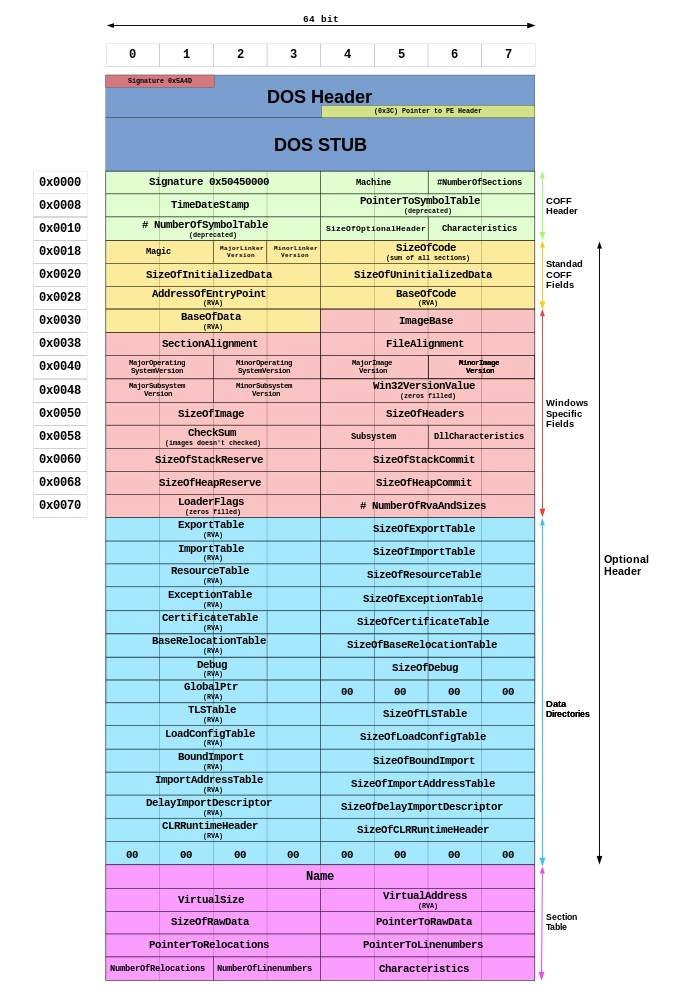

- Gồm 2 phần chính là Header và Section. Header sẽ gồm:

      - DOS MZ header
      - DOS stub
      - PE header
      - Section table

- Trong PE file sẽ có ít nhất 2 Sections: là code và data.

### 2. DOS Header

- Tất cả các file PE bắt đầu bằng DOS Header, vùng nhớ này chiếm giữ 64 bytes đầu tiên của file. Nó được dùng trong trường hợp chương trình của bạn chạy trên nền DOS.

- DOS Header là một cấu trúc được định nghĩa trong các file windows.inc hoặc winnt.h. Nó có 19 thành phần mà trong đó thành phần `magic` và `lfanew` là đáng chú ý:

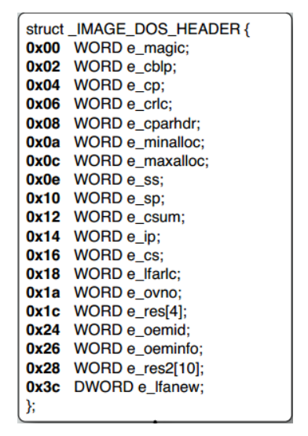

- Trong PE file, phần magic của DOS Header chứa giá trị 4Dh, 5Ah(đó là các kí tự "MZ", viết tắt của Mark Zbikowsky là một người sáng tạo chính của MS-DOS), các giá trị này là dấu hiệu thông báo cho chúng ta biết đây là DOS Header hợp lệ. MZ là 2 bytes đầu tiên mà bạn sẽ nhìn thấy trong bất kì một PE file nào.

- Phần `lfanew` là một giá trị DWORD và nó nằm ở vị trí cuối cùng của DOS Header và đằng trước nơi bắt đầu DOS Stub. Nó chứa offset của PE Header, Windows Loader sẽ tìm kiếm offset này vì vậy nó có thể bỏ qua DOS Stub và đi trực tiếp tới PE file.

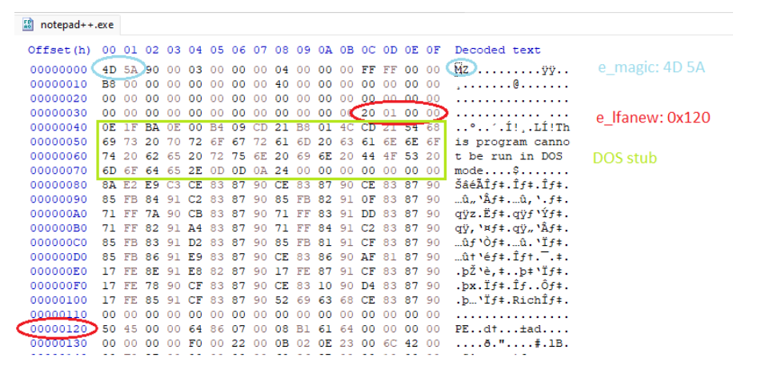

- Nếu bạn thắc mắc giữa phần `DOS Stub` và `PE Header` thì là gì? Thì đây là `Rich Header`, rất ít tài liệu nhắc đến phần này vì nó không ảnh hưởng gì đến chương trình khi thực thi, phần này chỉ để lưu lại thông tin chương trình biên dịch Visual Studio:

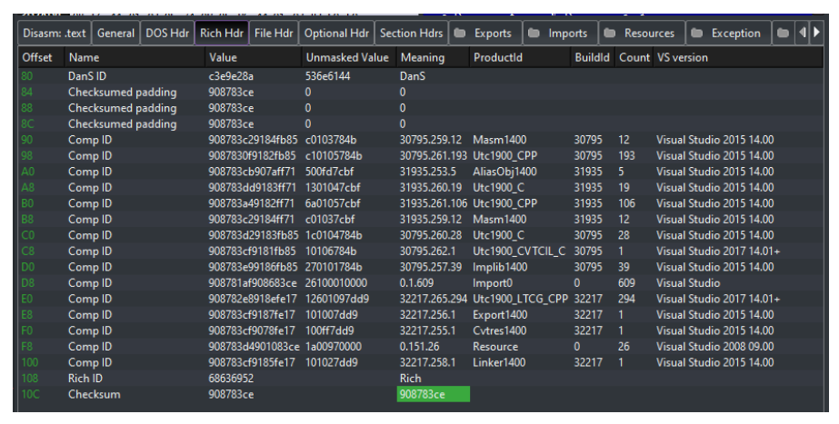

### 3. PE Header

- PE Header là thuật ngữ chung đại diện cho một cấu trúc được đặt tên là `IMAGE_NT_HEADER`. Cấu trúc này gồm những thông tin thiết yếu được sử dụng bởi `Loader`. `IMAGE_NT_HEADER` có 3 thành phần và được định nghĩa tring file `windows.inc` như sau:

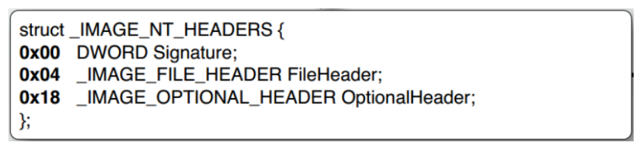

- `Signature` là một giá trị DWORD có giá trị: `50h, 45h, 00h, 00h` (Các kí tự "PE" được đi kèm bởi các giá trị tận cũng là 0).

- `FileHeader` là một struct 20 bytes, nó chứa thông tin về sơ đồ bố trí vật lý và những đặc tính của file.

- `OptionalHeader` thường có độ lớn 224 bytes nếu là Win32 và 240 bytes với Win64. Nó là một struct chứa thông tin về sơ đồ Logic bên trong của một file PE.

#### 3.1 File Header

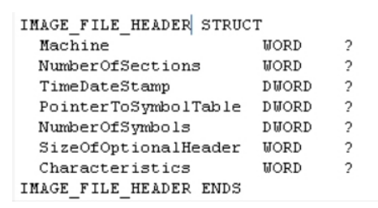

- Trong phần này có một số thông tin quan trọng như:

  - `Machine`: chứa thông tin về kiến trúc máy tính mà mà tệp thực thi được xây dựng để chạy trên( Intel 386, Intel 64, MIPS, ARM,...).
  - `Number of Section`: số lượng section trong section table(Chúng ta phải thay đổi phần này nếu như chúng ta muốn thêm hoặc xoá bất kì section nào trong một PE file).
  - `SizeOfOptionalHeader`: kích thước của Option Header.
  - `Characterristics`: xác định đặc điểm của file(exe,dll,...).

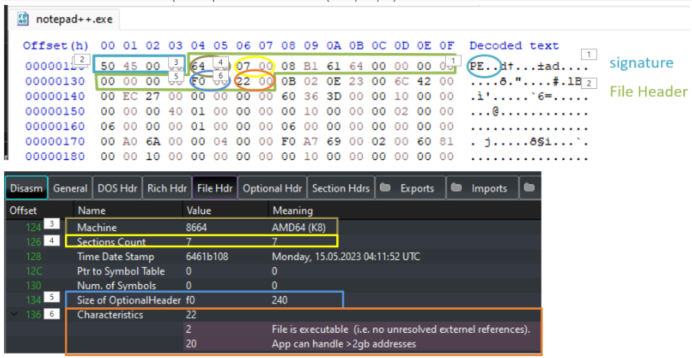

#### 3.2 Optional Header

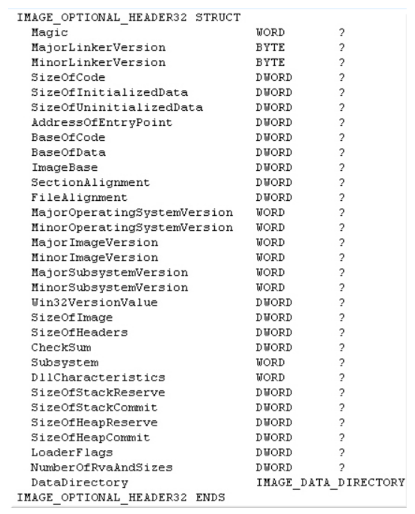

- `AddressOfEntryPoint` - RVA của câu lệnh đầu tiên mà sẽ được thực thi khi chương trình PE Loader sẵn sàng để run PE File. Nếu như bạn muốn làm thay đổi luồng thứ tự thực hiện, bạn phải thay đổi lại gái trị trong trường này thành một RVA mới và do đó câu lệnh tại giá trị RVA mới này sẽ được thực thi đầu tiên.
- `SizeOfCode` - Kích thước của code thực thi.
- `SizeOfInitializedData` - kích thước của dữ liệu được khởi tạo.
- `BaseOfCode` - chứa địa chỉ RVA của phần code(2 giá trị BaseOfCode và AddressOfEntryPoint - có thể giống nhau nếu phần địa chỉ bắt đầu của mã thực thi và địa chỉ bắt đầu của vùng nhớ mã thực thi trùng nhau).
- `ImageBase` - Địa chỉ nạp được ưu tiên cho PE File. Lấy ví dụ: Nếu như giá trị trong trường này là 400000h, PE Loader sẽ cố gắng để nạp file vào trong không gian địa chỉ ảo mà bắt đầu tại 400000h. Từ "được ưu tiên" ở đây không thể nạp file tại địa chỉ đó nếu như có một module nào khác đã chiếm giữ vùng địa chỉ này. 99% các trường hợp của ImageBase luôn là 400000h.
- `Section Alignment` - Phần liên kết của các Sections trong bộ nhớ. Khi file thực thi được ánh xạ vào bộ nhớ, thì mỗi section phải bắt đầu tại một địa chỉ ảo mà là một bội số của giá trị này. Giá trị cùa trường này nhỏ nhất là 0x1000(4096 byte).Ví dụ: Nếu giá trị tại trường này là 4096(1000h), thì mỗi section tiếp theo sẽ bắt đầu tại vị trí mà section trước đó cộng với 4096 \* n bytes. Nếu section đầu tiên là tại 401000h và kích thước của nó chỉ có 10 bytes, thì section tiếp theo là 402000h.
- `File Alignment` - Phần liên kết của các Sections trong file. Tương tự như Section Alignment nhưng áp dụng trong file khi vẫn ở bộ nhớ vật lý.
- `SizeOfImage` - Toàn bộ kích thước của PE image trong bộ nhớ. Nó là tổng tất cả các headers và sections được liên kết tới Section Alignment.
- `SizeOfHeader` - Kích thước tất cả các header + section table. Nói tóm lại, giá trị này là bằng kích thước file trừ đi kích thước được tổng hợp của toàn bộ sections trong file. Bạn cũng có thể sử dụng giá trị này như một file offset của Section đầu tiên trong PE file.
- `DataDirectory` - Một mảng 16 `IMAGE_DATA_DIRECTORY` structures, mỗi phần có liên quan tới một cấu trúc dữ liệu quan trọng trong PE File chằng hạn như IAT(Import Address Table). Cấu trúc này quan trọng trong Unpacking.

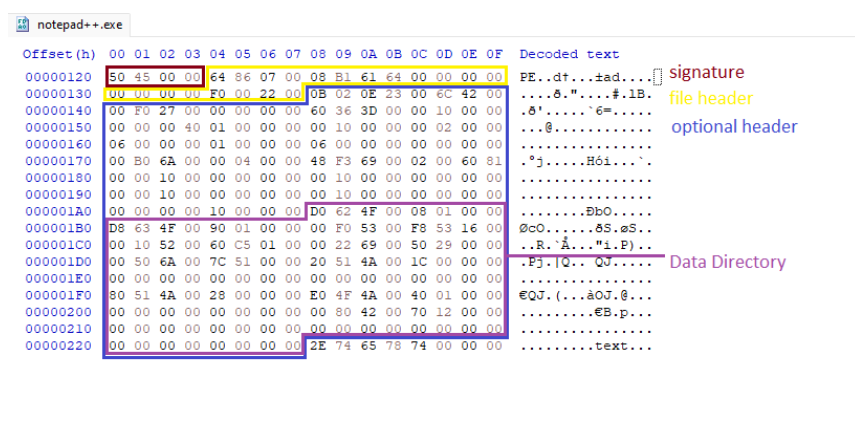

### 4.Data Directory

- `Data Directory` là 128 byte cuối của OptionalHeader, là thành phần cuối của PE Header - `IMAGE_NT_HEADERS`. `Data Directory` là một mảng cấu trúc `IMAGE_DATA_DIRECTORY` structure, cứ mỗi 8 8bytes thì mỗi phần lại có liên quan tới một cấu trúc dữ liệu quan trọng trong PE File. Mỗi mảng tham chiếu tới một mục đã định trước, ví dụ như `import table`. Cấu trúc của `Data Directory` bao gồm thông tin về địa chỉ và kích thước của cấu trúc dữ liệu:

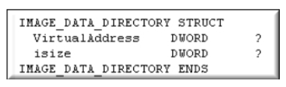

- `VirtualAddress` là một địa chỉ ảo tương đối(RVA) của cấu trúc dữ liệu.

- `isize` bao gồm kích thước theo bytes của cấu trúc dữ liệu.

- 16 Directory mà cấu trúc này tham chiếu được định nghĩa trong file windows.inc:

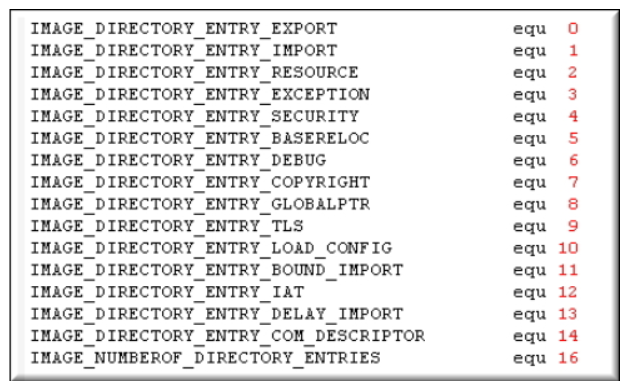

- Chúng ta có thể kiểm tra trong `PE Bear`

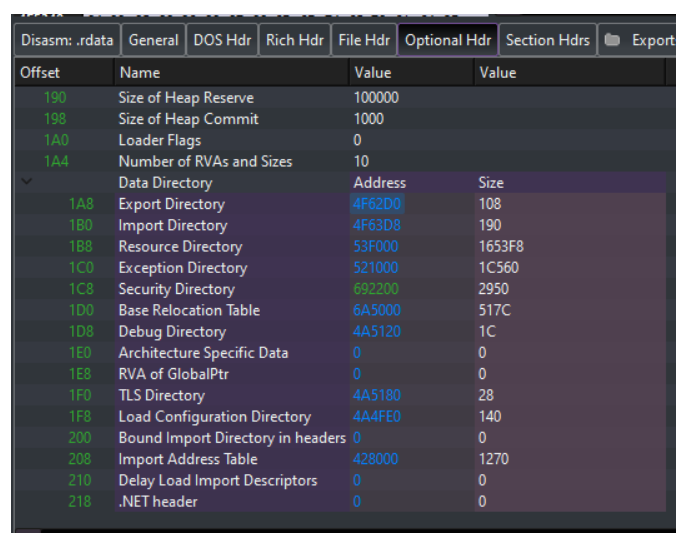

### 5. Section Table:

- Section Table là thành phần tiếp theo ngay sau PE Header. Nó là một mảng cấu trúc `IMAGE_SECTION_TABLE`, mỗi phần tử sẽ chứa thông tin về một section trong PE File ví dụ như thuộc tính của nó và VA(Virtual Address). Như vậy nếu có bao nhiêu `NumberOfSection` trong `FileHeader` thì sẽ có bấy nhiêu bản sao của cấu trúc này trong table. Mỗi cấu trúc là 40 bytes và sẽ không có thêm "padding" giữa chúng(Padding là chèn thêm các bytes có giá trị 00h vào). Cấu trúc này được định nghĩa trong file windows.inc:

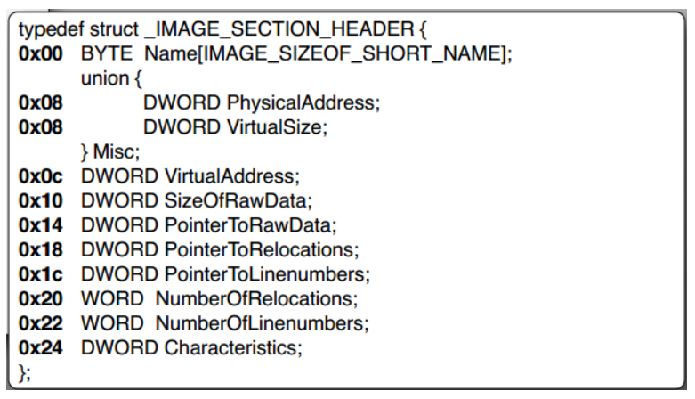

- `Name` - (8 bytes) Tên này chỉ là một nhãn và thậm chí có thể để trống. Và đây không phải chuỗi ascii vì vậy nó không cần phải kết thúc bằng việc thêm 0.

- `VirtualSize` - Kích thước thật sự của section's data theo byte. Nó có thể nhỏ hơn kích thước cảu sectione trên bộ nhớ vật lý(SizeOfRawData) và sẽ là những gì mà loader định rõ vị trí trong bộ nhớ cho section này.

- `VirtualAddress` - RVA của section. Trình PE loader sẽ phân tích và sử dụng giá trị trong trường này khi nó ánh xạ section vào trong bộ nhớ. Vì vậy nếu giá trị trong trường này là 1000h và Base address là 0x400000 thì section sẽ được nạp tại địa chỉ 401000h.

- `SizeOfRawData` - Kích thước của section's data trong file trên bộ nhớ vật lý, được làm tròn lên bội số tiếp theo của `File Alignment` bởi trình biên dịch.

- `PointerToRawData` - Thành phân này rất hữu ích vì nó là offset từ vị trí bắt đầu của file tới phần section's data. Nếu nó có giá trị là 0, thì section's data không được chứa trong file và sẽ bị bó buộc vào thời gian nạp(loadtime). Trình PE Loader sẽ sử dụng giá trị trong trường này để tìm kiến phần data trong section là ở đâu trong file.

- `Characteristics` - Bao gồm các cờ ví dụ như section này có chứa executable code, initialized data, uninitialized data, có thể được ghi hoặc đọc.

- Quay lại ví dụ Notepad++ của chúng ta:

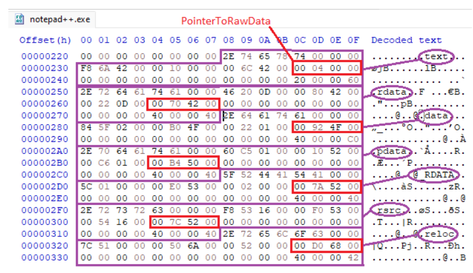

- Hình trên là 7 section trong chương trình và `PointerToRawData` của từng section.

### 6. PE File Sections

- Là những section chứa nội dung chính của file, bao gồm code, data, resource và những thông tin khác của file thực thi. Mỗi section có một Header và một body. Những `Section Headers` thì được chứa trong `Section Table` ta vừa phân tích nhưng những `Section Bodies` lại không có cấu trúc, chúng có thể được sắp xếp theo bất kì cách nào với điều kiện là Header được điều thông tin đầy đủ để có thể giải mã dữ liệu.

- `Executable Code Section`: Thường được đặt tên là `.text` hoặc là `CODE`, thường chứa mã thực thi.

- `Data Sections`:

  - Section `.bss` biểu diễn dữ liệu không được khởi tạo cho ứng dụng, bao gồm toàn bộ các biến đã được khai báo tĩnh trong một hàm hoặc một module nguồn.
  - Section `.rdata` biểu diễn dữ liệu chỉ đọc(read-only), ví dụ như chuỗi, các hằng, và thông tin thư mục debug.
  - Tất cả các biến khác(ngoại trừ biến cấp phát động, mà chỉ xuất hiện trên Stack) được lưu trong Section `.data`. Đó là những ứng dụng hoặc là những biến toàn cục.

- `Resources Section`: Section `.rsrc` chứa các thông tin resource cho một module. 16 bytes đầu tiên bao gồm 1 header giống như những section khác, nhưng dữ liệu của Section này được cấu trúc vào 1 resource tree và được quan sát tốt nhất qua 1 chương trình resource editor(Resource Hacker).

- `Export Data Section`: Section `.edata` chứa Export Directory cho một chương trình hoặc file DLL. Khi biểu diễn, section này bao gồm các thông tin về tên và địa chỉ của những hàm exported functions.

- `Import Data Section`: Section `.idata` chứa những thông tin khác nhau về những hàm imported functions bao gồm cả `Import Directory` và bảng `Import Address Table`.

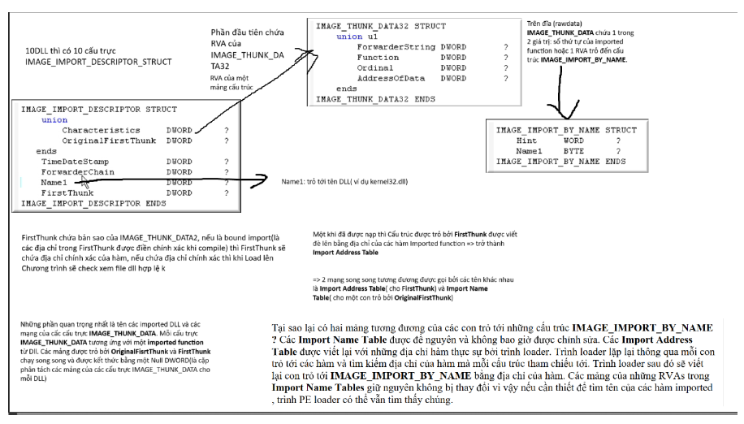

- `Debug Information Section`: Thông tin Debug được đặt ban đầu trong Section .debug. Thường file debug có đuôi là .dbg. Section debug chứa thông tin debug, nhưng những thư mục debug lại nằm trong `.rdata` như được đề cập ở trên. Mỗi thư mục sẽ liên quan đến thông tin Debug trong Section `.debug`.

- `Base Relocation Section`:

  - Phần Base reclocation(.reloc) chứa thông tin cần thiết để thực hiện việc thay đổi địa chỉ cơ sở(base address) của một module khi nó được tải vào bộ nhớ. Phàn này có vai trò quan trọng trong quátrinhf nạp và chạy một chương trinh. đảm bảo rằng các địa chỉ trong chương trình được định vị chính xác và đúng với địa chỉ bộ nhớ mà chương trình đang chạy.
  - Khi chương trình được nạp và chạy, trình nạp(loader) sẽ đọc phần `.reloc` và áp dụng cách điều chỉnh cần thiết vào các địa chỉ trong chương trình. Điều này đảmbaor rằng chương trình được định vị đúng trong bộ nhớ và có thể chạy mà không xảy ra xung đột địa chỉ hoặc lỗi tham chiếu.
  - Tóm lại, phần `.reloc` chứa thông tin để thực hiện điều chỉnh các địa chỉ cơ sở của một module khi chương trình được nạp vào bộ nhớ, đồng thời đảm bảo tính ổn định và khả năng chạy đúng của chương trình.


-------------------------------------------------------------------------------------


