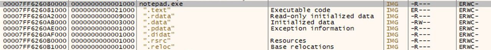

# Reverse-Engineering

- RE Android
- Decompile GCC, Clang và MSVC
    * IDA: decompiler cho C/C++/Golang
    * jadx: decompiler cho Java
    * dnSpy: decompiler cho C#
- RVA (Relative Virtual Address) is an address relative to the base address of the program, an address at which the executable was loaded (where its MZ signature can be found). Any its `VA = base address + RVA`.

- ...

## [0] Overview

- `Course:`
    * https://p.ost2.fyi/courses/course-v1:OpenSecurityTraining2+RE3011_re_cpp+2022_v1/about
    * [crackmes.one](https://crackmes.one/) .

- `Thực hành:` 
  * [IDA-kienmanowar](https://kienmanowar.wordpress.com/category/ida-pro-section/ida-tutorials/) .
  * [PE Analysis Report](https://hackmd.io/@antoinenguyen09/Hy0a2mb0t?fbclid=IwAR0zotdKiVJV-22nlqlGds9YOtvsE08MiKU-zMD8S1urx2mdYZC4nRk2BfQ) .
  * [Assemble-Reverse](https://0xinfection.github.io/reversing/) .

- `Tools:`
  * [Cpp=>Assemble](https://godbolt.org/) .

- `Writeup Reverse CTF:`
   * https://blog.anhtv.live/2023/07/10/cookie-arena-ss2/
   * [Flare-on 9](https://nextheia.com/tags/flare-on-9-write-up/) .
   * https://0ji54n.netlify.app/works/flareon9 .
   * [ASCIS 2022 - Faku](https://mochinishimiya.github.io/posts/ascis2022/?fbclid=IwAR1uNY6kSbsKBoyvQmbepMpdYjdBlOhfnY4yi9Hfs_ZAFJUalFQUTOZLjqA) .
   * [ISITDTU CTF 2018 Quals - inter](https://aides2593.github.io/writeup/re/2018/08/21/inter.html) .
    

- `References:`
    * [Slide SVATTT - RE b2](https://docs.google.com/presentation/d/1SBBp04TkILxE-vSARvI_Uo3aF7lswh-FT5dumWWssT0/edit?fbclid=IwAR33UPvpYYBkpxZL8qfOJ2V-XF6xxFhE5BRuVnrNZGVkLGHT2U0i1f-iOio#slide=id.g241d1437ad9_0_0) .
    * **Machine RE**
        + Windows-10 + https://github.com/mandiant/flare-vm .
        + [GNU Linux](https://remnux.org/?fbclid=IwAR3LEPYLKkJWe2rwHav8pwY9igS5e89p3q0sqFy8_ZNvkio-WHRRV99GjhA) .
        + [RE-Toolkit](https://github.com/mentebinaria/retoolkit?fbclid=IwAR1uAu_jBCIVc1y57PSv6xesm4Nedmw6ai23Nj-a58HxwDuSFNG4AcZVJA0) .
        + [LAB Tryhackme](https://tryhackme.com/room/windowsreversingintro?fbclid=IwAR3yC6T0hFYake1O9dIrP13sAlKdOxC2JJkXH79047LbxwHdmCQqjEOF1Jo) .
    * **AntiDebug**
        + https://users.cs.utah.edu/~aburtsev/malw-sem/slides/02-anti-debugging.pdf
        + https://www.apriorit.com/dev-blog/367-anti-reverse-engineering-protection-techniques-to-use-before-releasing-software#p4
        + https://www.veracode.com/blog/2008/12/anti-debugging-series-part-i
        + https://anti-debug.checkpoint.com/
        + **Questions:** exception, debugger là gì ?

## [1]. Cryptography
- Crypto (Dreamhack)
- https://cryptohack.org/courses/
- https://cryptopals.com/

## [2]. Forensics - Threat Hunting
- Tools forensics VM   * https://github.com/1259iknowthat/ForVM
  
- Dump Memory Tools:
  * https://github.com/volatilityfoundation/volatility
  * https://github.com/volatilityfoundation/volatility/wiki/Command-Reference

- `CTF>` BKsec-memorydump: https://gist.github.com/1259iknowthat/8cb818f0a37566b1fc25151ef074d9af

## [3]. MALWARE ANALYSIS

- https://xikhud.wordpress.com/
- https://github.com/wtsxDev/reverse-engineering
- https://github.com/mytechnotalent/Reverse-Engineering
- https://github.com/michalmalik/linux-re-101
- https://github.com/michalmalik/osx-re-101
- Malware
  * Bypass windows defender
  * certutil -hashfile <ten-file> (check hash virustotal)
  * https://github.com/Da2dalus/The-MALWARE-Repo
  * https://github.com/CMEPW/BypassAV
  * https://anonyviet.com/hacker-an-malware-vao-hinh-anh-va-thuc-thi-nhu-the-nao/?fbclid=IwAR23pXiQNxQkhijurEbGFHk2nuCeZn3VsBY0GgbrCcyx_ojOEgY7InjszLI_aem_AdKHux11-ltaYC1vH3PTR7guZ_n1Bv46eDb7VmGrCf8CoKgb1lL4IrHRJtUGyBA9iU8
  * https://github.com/nigmaz/Blogs/tree/main/Tools-Support
  * sheet reader => rce cve (Malware Excel)
  * microsoft visual basic for application (Malware Excel)
  * https://class.malware.re/
  * https://knightz1.github.io/blog/malware/analysis/2022/11/30/Malware-analysis.html
  * [dll side loading](https://whitehat.vn/threads/ky-thuat-dll-side-loading-la-gi.17345/?fbclid=IwAR3Ru7pXgl6xgUdXTxu-UhhHpVghC5BGHEz3uXo9FpEsJ8wV5W9oPW3tqoM) .
  * [malware analysis](https://cocomelonc.github.io/tutorial/2022/05/09/malware-pers-4.html) .
  * Tấn công thông qua sửa Windows Registry => sửa tham số hệ thống, có 1 dịch vụ dangerous là `remote windows registry`.
  * Các cơ chế `Autorun` nhằm `Persistence` như:
      + services 
      + schedules task
      + office application startup
  * Lây lan qua mạng `Lateral Movement` Tools chuyển tiếp gói tin, pivot point làm lây lan từ máy victim vào mạng, có hai cách là:    
      + forwarding / proxy (Blueteam dễ điều tra hơn)
      + tunneling (đóng  gói traffic trong protocol khác). (VD: ssh tunneling)

- Paper tech and real attack
  * https://whitehat.vn/threads/chien-dich-aurora-va-cuoc-chien-ngam-tren-khong-gian-mang-giua-hai-sieu-cuong-phan-1.17333/
