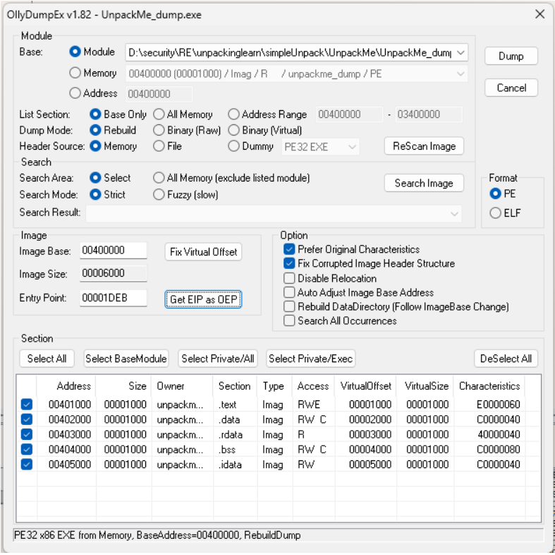
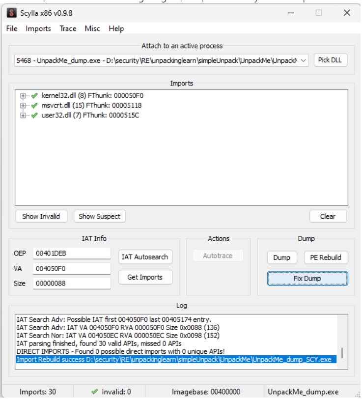

# Unpacking

> Bước cơ bản trong unpack

## I. Tìm OEP

- Dùng PEiD hoặc infoExe để biết được chương trình được Pack bằng gì.
- Load chương trình vào x64dbg để tìm OEP.
- Đặt EIP tại nơi mà mình nghĩ là OEP, sau đó dùng Plug-in của x64dbg [OllyDumpEx](https://low-priority.appspot.com/ollydumpex/) => Get EIP as OEP => Dump.



## II. Tìm RVA và RVA Size( Fix ITA - Import Address Table )

- Import Address Table(IAT) chứa các địa chỉ hàm API mà chương trình sử dụng.
- Ta sẽ có 2 cách làm: (1)IAT Auto Search và (2) Manual.
- IAT Auto Search nhanh hơn nhưng trong một số trường hợp không thể tìm hết RVA và RVA size được nên ta phải tìm bằng cách Manual.

### II.1 - Dùng IAT Auto Search

- Mở file ta vừa dump bằng OllyDumpEx vào x64dbg.
- Sau đó dùng Scylla có sẵn trong x64dbg: `IAT Autosearch -> Get Imports -> Fix Dump`.
- Ta sẽ được file mới. Nếu không có gì đặc biệt thì file này đã đc Unpack thành công.



### II.2 - Manual

- Studying…

## III. Làm sạch và giảm kích thước file sau khi UnPack:

- Để hoàn thiện hơn ta tiến hành quá trình làm sạch file và giảm kích thước file sau khi Fix Dump( để file càng nhỏ càng tốt,tuy nhiên nếu bạn không thích có thể bỏ qua bước này).
- Sau khi `Fix Dump` ở bước 2 xong ta sẽ ấn PE Rebuild và chọn file ta vừa Fix Dump, click Open và ta có file mới hoàn toàn để tiến hành CRACK.
- Kiểm tra file cuối cùng bằng PEID, ta biết ngôn ngữ của chương trình.

## IV. Chú Ý:

- Các bước trên là các bước căn bản, bắt buộc phải có, một số trường hợp đặc biệt thì ta cần phải có cách tiến hành hơi khác đi một chút.
- Chủ yếu là cách tìm ra OEP, fix IAT. Cách tìm OEP căn bản nhất là trace từng lệnh một. Cũng cần biết về antiDebug để chống lại.
- Thường OEP bắt đầu với lệnh cân bằng stack đơn giản là:

```asm
PUSH EBP
MOV EBP,ESP
...
```

- Cho nên thường khi trace mà gặp lệnh này thì ta nên lưu ý.

# Unpack

> Unpack in IDA

- Manual load + Create imports segment.
