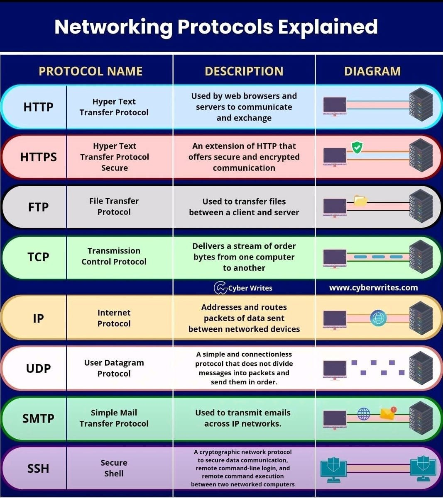

# Nmap

- Scan command:
    * sudo nmap -A -T4 <ip> | Scan port service server open

    * sudo nmap -sS <ip>
- Network for attack & defense
  * application layer => transport layer => internet layer => link layer => [physical layer | physical layer] => link layer => internet layer => transport layer => application layer
 

## [1]. NETWORK

- Cả hai OSI (Open Systems Interconnection) và TCP/IP (Transmission Control Protocol/Internet Protocol) là các mô hình được sử dụng để mô tả cách mà các giao thức mạng hoạt động. Dưới đây là mô tả ngắn về cả hai:

### Mô hình OSI (Open Systems Interconnection):

- Mô hình OSI chia quá trình truyền thông mạng thành 7 lớp khác nhau. Các lớp này mô tả các chức năng khác nhau mà hệ thống mạng cần thực hiện để truyền thông thành công.

1. **Lớp 1 - Lớp Vật lý (Physical Layer)**:
   - Nhiệm vụ: Định nghĩa các thiết bị vật lý và truyền dẫn dữ liệu qua các phương tiện truyền thông như cáp, sóng radio, và các kỹ thuật vật lý khác.

2. **Lớp 2 - Lớp Liên kết dữ liệu (Data Link Layer)**:
   - Nhiệm vụ: Đảm bảo kết nối đáng tin cậy giữa các thiết bị trong một mạng cục bộ (LAN). Điều này bao gồm quy trình kiểm soát lỗi, định địa chỉ MAC và đảm bảo gói tin được gửi tới đúng đích.

3. **Lớp 3 - Lớp Mạng (Network Layer)**:
   - Nhiệm vụ: Định tuyến (routing) dữ liệu trên mạng và quyết định các con đường tối ưu giữa nguồn và đích.

4. **Lớp 4 - Lớp Giao thức Truyền thông (Transport Layer)**:
   - Nhiệm vụ: Đảm bảo giao tiếp đáng tin cậy giữa các thiết bị trên mạng, bao gồm việc chia nhỏ dữ liệu thành các gói tin nhỏ hơn và xác định cách sắp xếp chúng.

5. **Lớp 5 - Lớp Phiên (Session Layer)**:
   - Nhiệm vụ: Quản lý kết nối và phiên làm việc giữa các thiết bị trên mạng.

6. **Lớp 6 - Lớp Trình diễn (Presentation Layer)**:
   - Nhiệm vụ: Đảm bảo dữ liệu được truyền tải đúng cách và được mã hóa/ giải mã theo cách đúng.

7. **Lớp 7 - Lớp Ứng dụng (Application Layer)**:
   - Nhiệm vụ: Cung cấp các giao diện ứng dụng để tương tác với người dùng hoặc các ứng dụng khác.

### Mô hình TCP/IP (Transmission Control Protocol/Internet Protocol):

- Mô hình TCP/IP tập trung vào việc mô tả cách mà các giao thức TCP/IP (bao gồm cả TCP và IP) hoạt động trên mạng.

1. **Lớp 1 - Lớp Giao thức Truyền thông (Application Layer)**:
   - Tương đương với lớp 7 trong mô hình OSI, nhưng TCP/IP đưa ra nhiều giao thức cụ thể hơn cho ứng dụng, bao gồm HTTP, SMTP, FTP, và nhiều giao thức khác.

2. **Lớp 2 - Lớp Liên kết dữ liệu (Internet Layer)**:
   - Tương đương với lớp 3 và 4 trong mô hình OSI. Nó bao gồm giao thức Internet Protocol (IP) và các giao thức liên quan đến việc định tuyến và chuyển tiếp dữ liệu.

3. **Lớp 3 - Lớp Mạng (Transport Layer)**:
   - Tương đương với lớp 4 trong mô hình OSI. Nó bao gồm giao thức Transport Control Protocol (TCP) và User Datagram Protocol (UDP) để quản lý truyền tải dữ liệu.

4. **Lớp 4 - Lớp Giao thức Truyền thông (Physical Layer)**:
   - Tương đương với lớp 1 và 2 trong mô hình OSI. Bao gồm các giao thức và thiết bị vật lý dùng để truyền dữ liệu qua các phương tiện truyền thông.

- Mô hình TCP/IP được thiết kế để phù hợp với cách mà Internet hoạt động, trong khi mô hình OSI mang tính lý thuyết hơn và không thực sự triển khai rộng rãi trong thực tế.

## [2]. REFERENCES
- ...
